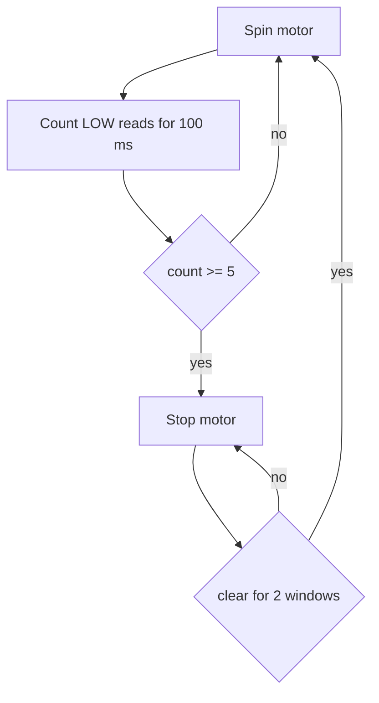
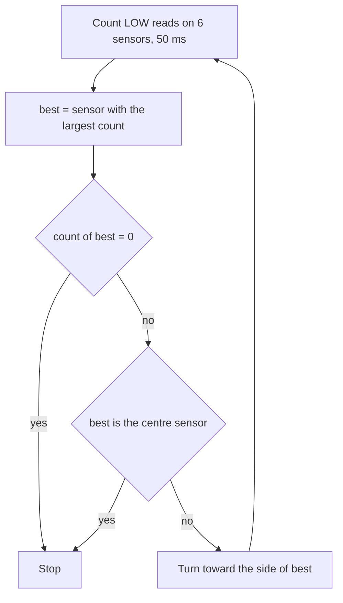
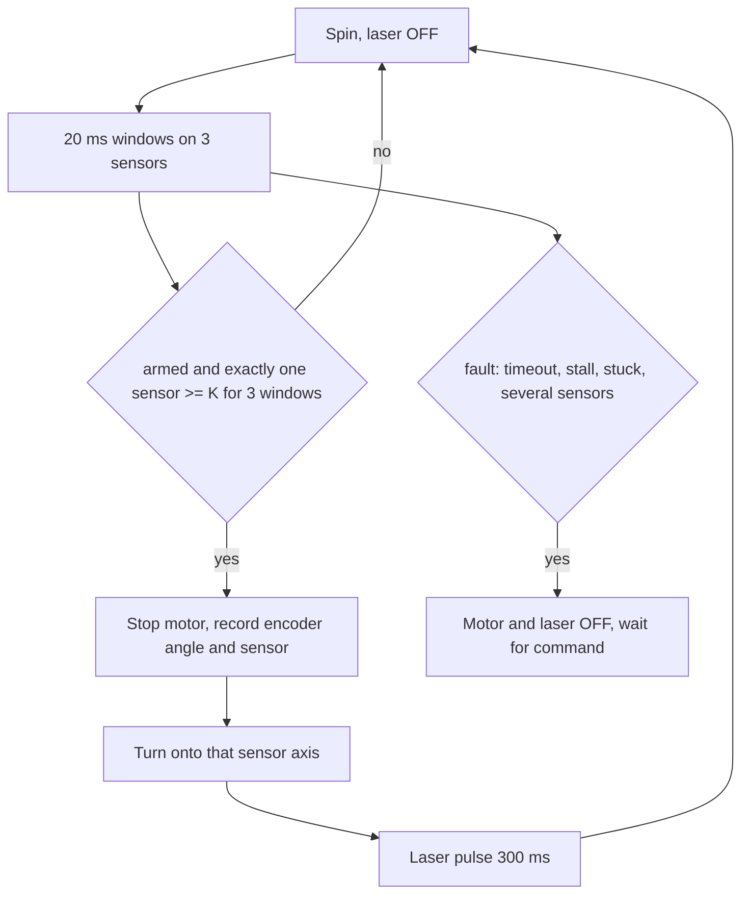
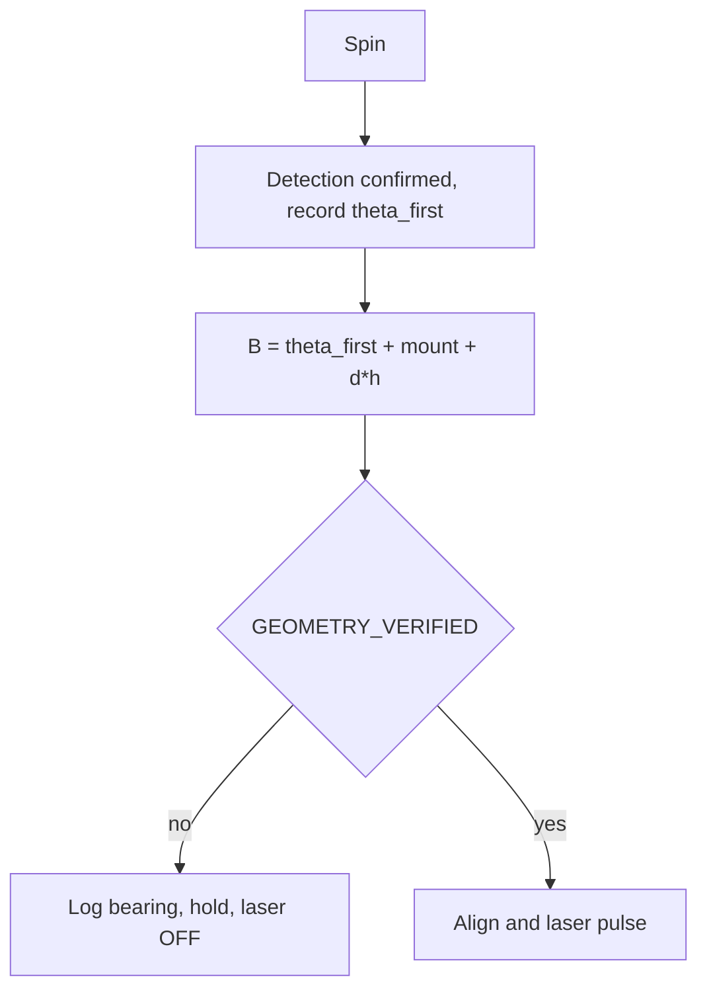
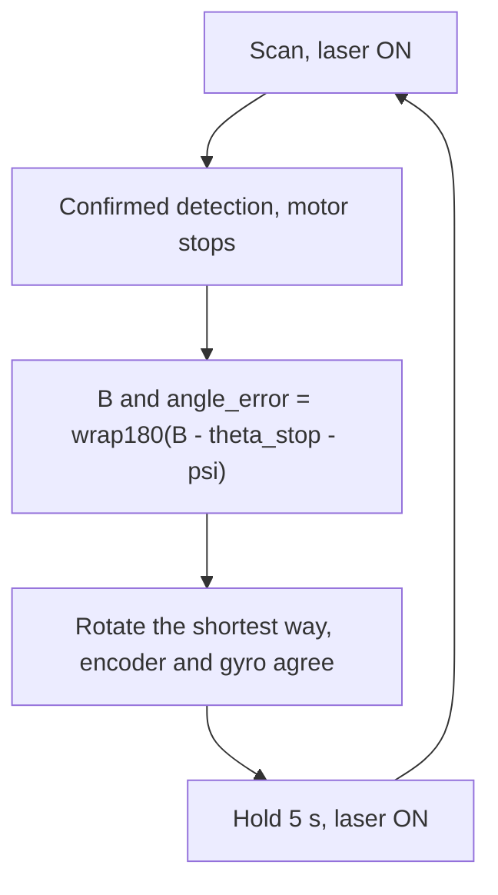
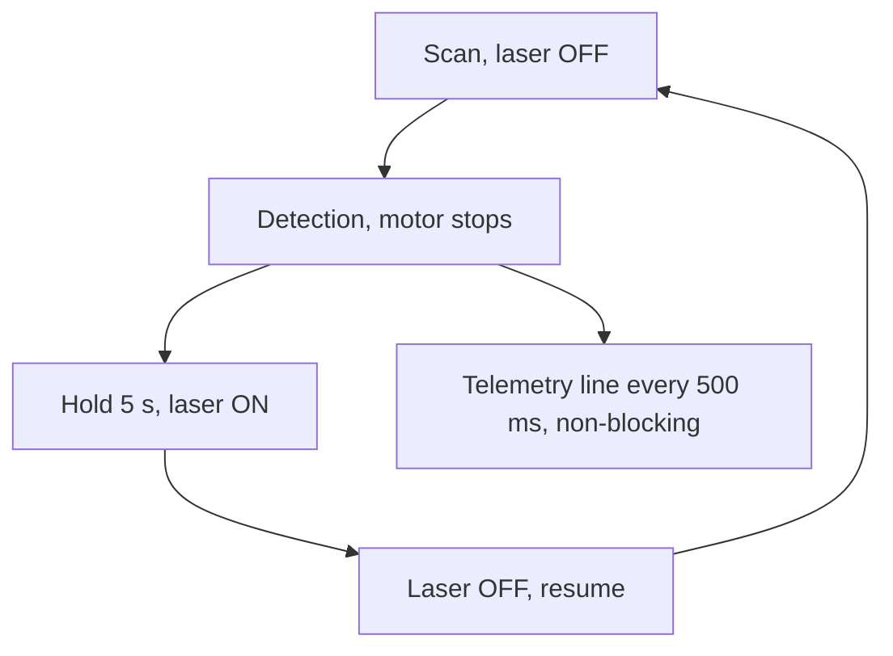
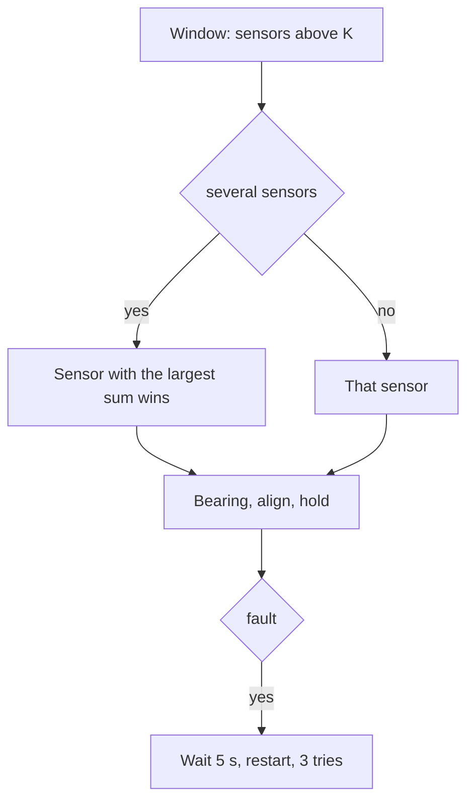
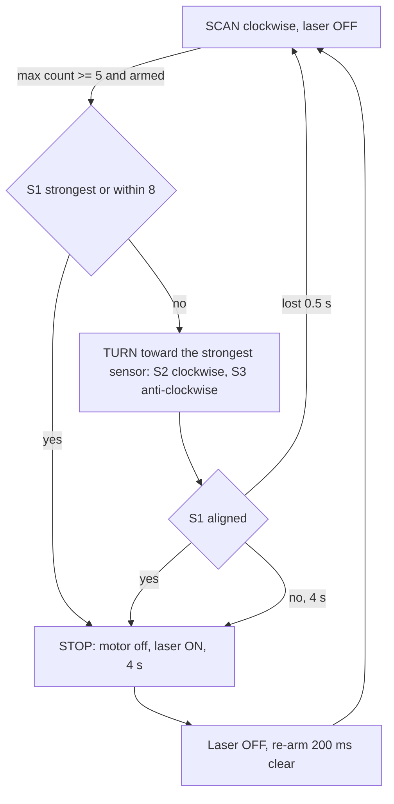
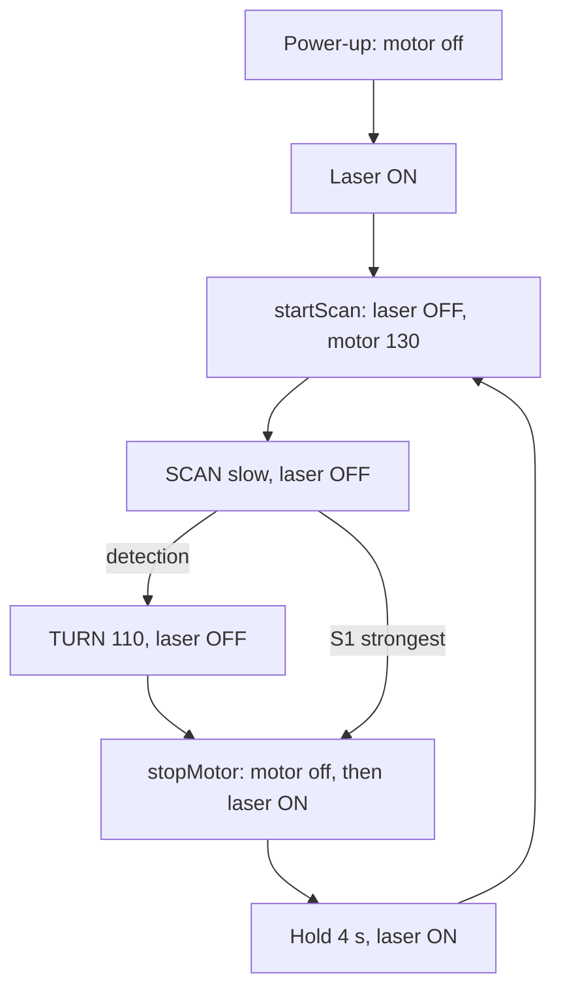

# Spin Detect – documentation (one file)

> **Latest version: v1.1** (slow speed, laser ON = motor OFF). This file holds everything for the `spin_detect` program:
> **Part 1** – overview: need, process, what was done, problems, maths and a flowchart for every version;
> **Part 2** – code explanation of the current version (v1.1);
> **Part 3** – the earlier advanced encoder + gyro + bearing design (v0.5–v0.9), kept in full.
> Section numbers inside a part refer to that part. Run: `pio run -e spin_detect -t upload`, then `pio device monitor -e spin_detect` (115200 baud).

---

<a id="part-1"></a>

# PART 1

# Spin Detect – overview: process, problems, maths and flowcharts per version

This is the **overview document** for the `spin_detect` program. The **code document** (function-by-function explanation of the current version v1.1) is [Part 2](#part-2); the earlier encoder/gyro/bearing design is kept in full in [Part 3](#part-3). Only this one file is kept for the `spin_detect` program; each new version adds a section here and updates Part 2.

## 1. What we need to achieve

* An assembly spins and watches three IR sensors (TSOP4138, 38 kHz, ±45°, output active-LOW) for a message from an IR beacon.
* When the message is confirmed, the motor **stops**, pointing at the message, and the **red laser marks the target** for 4 s (the laser is ON when the motor is OFF); then scanning resumes.
* Reliable first, accurate second: it must never "spin forever without stopping", never fire the laser while moving, and must not be fooled by noise or by re-detecting the same target.
* Simple enough to bench-test with only the sensors, the motor driver and the laser.

## 2. Version overview

| Version | Environment | Idea | Result |
|---|---|---|---|
| v0.1 | `ir_sensor_test` | measure LOW-read counts of the 3 sensors, motor asleep | gives the threshold K |
| v0.2 | `spin_until_ir` | spin, stop when the count ≥ K, resume when clear | **proven base** |
| v0.3 | `directional_ir` | 6 sensors 60° apart, turn toward the strongest | direction only, no position, no laser |
| v0.5 | `spin_detect` (early) | 3 sensors 120° apart + encoder + faults + laser pulse | complete but many unmeasured calibrations |
| v0.6 | `spin_detect` | `spin_until_ir` K and re-arm, first-crossing bearing, ALIGN gate | laser/alignment held back until verified |
| v0.7 | `spin_detect` | MPU6050 gyro (A4/A5, 0x68), encoder/gyro fusion, shortest-path rotation, 5 s hold | laser ON while scanning (as requested then) |
| v0.8 | `spin_detect` | laser ON only in the hold, live telemetry | field log showed gyro / fault problems |
| v0.9 | `spin_detect` | fixes from the field log (strongest sensor wins, gyro retries, auto-restart) | "does not receive, none stop, no laser" |
| v1.0 | `spin_detect` | **simple rewrite** of `spin_until_ir` + per-sensor turn + 4 s stop | the approved simple behaviour |
| **v1.1** (current) | `spin_detect` | slow speed, laser ON = motor OFF | see section 3.9 |

Method: for the later versions each change was first written as a small computer model (cosine beam ±45°, noisy counts, first-order motor response) so the logic could be checked before the code was handed over; models show the behaviour of the logic, not real hardware numbers.

---

## 3. Versions in detail

### 3.1 v0.1 + v0.2 – measure, then spin until IR (base)

**Need:** know what the sensors read and stop the motor when the message arrives.
**Done:** `ir_sensor_test` prints the LOW-read count of D4/D5/D6 per 100 ms (motor asleep); `spin_until_ir` spins the motor, counts the LOW reads of the sensor in a 100 ms window, stops when `count ≥ K` and resumes after 2 clear windows.
**Problem:** one detection channel – no direction, no position, no laser.
**Maths:**
```
loop time ≈ 3·4.5 µs (reads) + 100 µs (delay) + ~3 µs ≈ 117 µs         (estimate)
N = 100 ms / 117 µs ≈ 850 reads per window        K = 5  → 0.6 ms LOW, 0.6 % duty
reaction ≤ W (100 ms), worst case 2·W;   overshoot Δθ = ω·(t_detect + t_stop)
```


### 3.2 v0.3 – six sensors, turn toward the strongest (`directional_ir`)

**Need:** know *which side* the message comes from.
**Done:** a ring of 6 sensors 60° apart (D4, D5, D6, A0, A1, A2); the sensor with the largest count decides: centre = stop, right side = turn one way, left side = the other, no signal = stop.
**Problem:** only direction bins (stop / left / right); no angle, no laser, no marker.
**Maths:** `360° / 6 = 60°` spacing; `best = argmax count_i`; steering by the sign of the strongest sensor's angle (−180°…+180°).


### 3.3 v0.5 – three sensors 120° apart, encoder, faults, laser pulse

**Need:** three sensors (360/3 = 120° apart) covering the circle by rotation, position tracking, a laser marker, defined fault behaviour.
**Done:** sensors D4/D5/D6 at 0°/120°/240°; counts in 20 ms windows; a detection needs **exactly one** sensor above K for 3 windows after the sensors have been clear (armed); encoder angle `θ = counts·360/CPR`; fault states (no detection timeout, encoder stall, sensor stuck, several sensors at once, align timeout); after the stop the assembly turns toward the sensor's axis and the laser pulses 300 ms.
**Problem:** many unmeasured calibrations (counts per revolution, beam width, geometry); the "exactly one sensor" rule turned a normal case (a beacon reaching two sensors) into a fault.
**Maths:** coverage `3·90° = 270°`, three gaps of `120° − 90° = 30°`, so a target is seen after at most 30° of rotation; false-trigger estimate `P ≈ 3·p³` per window triple; reaction `(3+1)·20 ms + t_stop`.


### 3.4 v0.6 – spin_until_ir settings, bearing, alignment gate

**Need:** make detection behave like the proven `spin_until_ir` and calculate where the target is.
**Done:** K = 5 and 200 ms re-arm as in `spin_until_ir`; bearing from the *first-crossing* position `B = θ_first + φ + d·h` (the stop position is not used because of overshoot); a `GEOMETRY_VERIFIED` gate: unverified = log the bearing, do not align, laser OFF.
**Problem:** the laser never fired until the gate was opened, and the bearing depended on an unmeasured `EDGE_HALF_DEG`.
**Maths:** `α = B − (θ + φ_i)`; the sensor first reaches K when the target is `h` ahead of its axis, so `B = θ_first + φ_i + d·h`; uncertainty `± (ω·W + σ_h + parallax)`, with `ω·W = 3.6°` at 30 rpm and `α_C = atan2(D·sin α, R + D·cos α)` for parallax.


### 3.5 v0.7 – MPU6050, encoder/gyro fusion, shortest path, 5 s hold

**Need:** use the gyro together with the encoder, rotate the shortest way to the target, stop and hold 5 s with the laser ON; MPU6050 on A4/A5, address 0x68.
**Done:** gyro enabled only after ACK at 0x68, `WHO_AM_I = 0x68` and a bias calibration; angle source = encoder (if calibrated) else gyro; encoder/gyro cross-check; `angle_error = wrap180(B − (θ_stop + ψ))` rotates the shortest way; hold 5 s; laser ON while scanning (as requested at that time).
**Problem:** more states and more things that can fail; laser lit all the time while searching was not what was wanted in the end.
**Maths:**
```
ω = raw/LSB − bias (LSB 32.8 at ±1000 dps);  θ_gyro += gyroSign·ω·Δt;  |ω| < 0.3 dps ignored
angle_error = wrap180(B − (θ_stop + ψ)),  > 0 clockwise, |error| ≤ 180°  (B = 10°, θ = 350° → +20°, not −340°)
cross-check |Δθ_enc − Δθ_gyro| ≤ max(8°, 15 %)
```


### 3.6 v0.8 – laser only in the hold, telemetry

**Need:** laser OFF while searching and ON only after the stop at the target; a clear live diagnostic line.
**Done:** `applyLaser()` makes the laser ON only in the HOLD state; non-blocking telemetry line (Acc, Gyro, temperature, encoder, gyro angle, signal confidence, bearing, error, motor, laser, state); `spin_detect_one` added; `ALIGN_ENABLED` default false.
**Problem:** the first field log showed `MPU6050 bias calibration rejected (spread 11 dps)` (the assembly was still coasting after the monitor reset the board), and a `MULTI_SENSOR` fault that stopped the motor with the laser OFF, forever.
**Maths:** telemetry buffer sent with `availableForWrite()` so it never blocks the 100 µs sampling; 230 characters at 9600 baud ≈ 240 ms ≈ 48 % of the line at 500 ms intervals.


### 3.7 v0.9 – fixes from the field log

**Need:** remove the stoppers seen in the log.
**Done:** several sensors seeing the beacon is no fault — the sensor with the largest LOW-read sum wins; gyro bias calibration waits (up to 10 × 1 s) and retries during the hold; automatic restart after a fault (3 tries, 5 s apart); `ALIGN_ENABLED` default true.
**Problem:** still "does not receive the message, never stops, no laser" on the bench: the program had grown to ~1000 lines with encoder, gyro, bearing, faults and commands, and every one of those could stop it from working.
**Maths:** strongest sensor `argmax Σ counts` over the 3 confirming windows; fault retry `t = 5 s`, `n ≤ 3`.


### 3.8 v1.0 – simple rewrite based on spin_until_ir

**Need:** a version that is as simple as the proven `spin_until_ir` and works with only the sensors, motor and laser; a motor turn toward the sensor that saw the message (clockwise / anti-clockwise by sensor); a 4 s stop with the laser ON; output with the sensor counts and Acc/Gyro.
**Done:** removed encoder, gyro integration, bearing, faults, commands; kept the 100 ms counting window, K = 5, 2-window re-arm; per-sensor turn direction (`SENSOR_TURN = {0, +1, −1}`); stop when S1 (laser axis) is the strongest (`count_S1 ≥ K` and `count_S1 + 8 ≥ count_best`); turn limit 4 s, lost target 0.5 s; 4 s stop; MPU6050 (0x68) for display only; 115200 baud.
**Problem:** none in the logic, but the laser was only switched on inside the stop state, so it was never seen if no stop happened, and the speed was too fast for the bench (v1.1).
**Maths:** counting as in 3.1; `aligned = detected ∧ c_S1 ≥ K ∧ c_S1 + 8 ≥ max c`; turn distance up to `120° + 45° = 165°` → needs `ω ≥ 165°/4 s ≈ 41 °/s`; stop timed to ≈ 1 ms.


### 3.9 v1.1 (current) – slow speed, laser ON whenever the motor is OFF

**Need:** slower motion, and the laser ON whenever the motor is OFF.
**Done:** `SPIN_SPEED` 200 → 130, `TRACK_SPEED` 150 → 110; the laser rule moved into the motor functions: `stopMotor()` switches the laser ON after the motor has stopped, `driveMotor()` switches it OFF before the motor starts; at power-up (motor off) the laser is ON until scanning starts; a reversal pause does not touch the laser.
**Problem:** none reported yet (not yet bench-tested). Open risks: the arming rule needs a clear gap (2 windows) before the first detection, which at the old fast speed was longer than the gap between 120°-apart beams; the slower speed makes the gap about twice as long. If the arming still blocks, start `armed = true`.
**Maths:**
```
assumed response ω ≈ (PWM − 60)·1.29 °/s :  PWM 130 ≈ 90 °/s, 110 ≈ 65 °/s       (was 180 / 130 °/s)
gap between beams t_gap = (s − β)/ω = 30°/90 °/s ≈ 333 ms  > the 200 ms re-arm clear (at 180 °/s it was 167 ms)
turn of 165° at 65 °/s ≈ 2.5 s < TRACK_TIMEOUT 4 s
laser = ON ⇔ PWM = 0 ;  order: motor stops → laser ON ;  laser OFF → motor starts
```


## 4. Problems and what they taught us

| Problem seen | Cause | Fix / lesson |
|---|---|---|
| spin but never stops (several versions) | detection or stop depended on conditions that rarely held (arming gaps, five-condition stops, faults) | keep one simple stop rule and a time limit |
| `MULTI_SENSOR` fault stopped the motor for good | a normal case (beacon reaching two sensors) treated as an error | strongest sensor wins (v0.9) |
| gyro disabled at boot | bias measured while the assembly was still coasting | wait and retry (v0.9); the simple version needs no gyro |
| laser never on | laser only switched in a stop that never came | laser tied to the motor (v1.1) |
| too many things to calibrate | encoder CPR, gyro bias, geometry, beam width | v1.0/v1.1 need only the sensors, motor and laser |

## 5. How to add the next version
1. Add a section "v1.x" in Part 1: need, what was done, problem, maths, flowchart.
2. Update Part 2 (code explanation) for the new code.
3. Keep only this one file for `spin_detect` (the archived design stays in Part 3).

---

<a id="part-2"></a>

# PART 2

# Spin Detect (v1.1) – simple version, based on spin_until_ir (slow speed, laser ON = motor OFF)

Environment `spin_detect` · source [src/spin_detect_main.cpp](src/spin_detect_main.cpp) · Nano V3 · **115200 baud**.

```
pio run -e spin_detect -t upload
pio device monitor -e spin_detect
```

> **Status: compiles; not bench tested.** The sensor-to-direction table and all timing values are assumptions taken from the intended layout – check them with the bench procedure in section 9.
> This replaces the earlier encoder/gyro/bearing version (kept as reference in [Part 3](#part-3); `spin_detect_one` still uses that logic).

---

## 1. What it does

The motor spins like `spin_until_ir`. Three IR sensors are read in 100 ms windows. When one sees the signal:

```
SCAN (clockwise, laser OFF)
  └─ signal on S1 (laser axis) ─────────────────────────► STOP
  └─ signal on S2 / S3 ─► TURN clockwise / anti-clockwise toward that sensor ─► S1 sees it ─► STOP
STOP: motor off, laser ON for the whole 4 s ─► laser OFF ─► SCAN again
```

* **Laser (v1.1 rule): the laser is ON whenever the motor is OFF** (at power-up and for the whole 4 s of every stop) and **OFF whenever the motor is spinning or turning**. `stopMotor()` switches it ON, `driveMotor()` switches it OFF – the only places that touch D10 besides `setup()`.
* **Direction depends on the sensor:** S2 → clockwise, S3 → anti-clockwise (table in section 3). If S1 already sees the target the motor just stops.
* **Stop = 4 s**, then the laser goes OFF and the motor spins again. No fault state, no commands, no latch: it always resumes.
* A turn that never reaches S1 ends after 4 s in a stop (laser ON); a turn that loses the signal for 0.5 s returns to scanning.

## 2. Wiring

| Signal | Pin |
|---|---|
| Motor nSLEEP / DIR / PWM | D7 / D8 / D9 (DIR HIGH = clockwise, as `motor_onoff`) |
| S1 / S2 / S3 (TSOP4138, active-LOW, `INPUT_PULLUP`) | D4 / D5 / D6 |
| Laser (HIGH = ON) | D10 |
| MPU6050 VCC / GND | 5 V / common GND with driver and sensors |
| MPU6050 SDA / SCL | A4 / A5 |
| MPU6050 AD0 | GND (address 0x68) |
| MPU6050 INT, XDA, XCL | not connected |

The MPU6050 is for display only; the control does not depend on it, and the program keeps running if it is missing (`IMU:OFF`).

## 3. Sensor → direction, geometry

Intended layout (from the sketch): S1 on the laser axis (0°), S2 at +120° (clockwise of S1), S3 at 240° = −120° (anti-clockwise of S1). Each sensor sees ±45° (TSOP4138), β = 90°.

| Sensor | Pin | Mount | `SENSOR_TURN` | Meaning |
|---|---|---|---|---|
| S1 | D4 | 0° | 0 | on the laser axis → aligned → stop |
| S2 | D5 | +120° | +1 | turn clockwise |
| S3 | D6 | −120° | −1 | turn anti-clockwise |

Shortest-path logic: to bring S1 onto a target that S2 sees, S1 must travel +120° (clockwise); for S3 it is −120° (anti-clockwise). The sign of the mount angle (normalised to ±180°) is the turn direction, so each sensor turns the short way.

Coverage: 3 · 90° = 270° at any instant, three 30° gaps (`120° − 90°`); while scanning, the assembly rotates, so a target is seen after at most 30° of rotation.

Time allowed for the turn: the target can sit anywhere in the sensor's beam, so S1 may have to travel up to `120° + 45° = 165°`. With `TRACK_TIMEOUT_MS = 4 s` this needs a turning speed of at least `165° / 4 s ≈ 41 °/s`; at 60 °/s it takes ≤ 2.75 s.

> **Configure:** if your sensors are wired differently (for example D4 = left, D5 = right, D6 = centre as in `directional_ir`), change `SENSOR_TURN` and `CENTRE_SENSOR` – nothing else needs to change. For that layout: `{ -1, +1, 0 }` and `CENTRE_SENSOR = 2`.

## 4. Detection (same method as spin_until_ir)

Each window counts, per sensor, the reads that are LOW (the TSOP output is active-LOW):
```
loop time ≈ 3 · 4.5 µs (reads) + 100 µs (delay) + ~3 µs ≈ 117 µs          (estimate)
N = WINDOW_MS / loop time = 100 000 µs / 117 µs ≈ 850 samples per window
count_i = number of LOW reads of sensor i          detected = max(count_i) ≥ K,  K = 5  (≈ 0.6 ms LOW, 0.6 % duty)
```
`K = 5` is the `spin_until_ir` value. `CONFIRM_WINDOWS = 1` means one window decides (as `spin_until_ir`); set 2 for more noise immunity at the cost of a further 100 ms.

* **Strongest sensor** `best = argmax count_i` decides the turn direction.
* **Aligned** (stop condition): `count_S1 ≥ K` **and** `count_S1 + ALIGN_MARGIN ≥ count_best` (`ALIGN_MARGIN = 8`, ≈ 11 % of a count of 72). Example from your log, `S1: 72  S2: 71  S3: 71` → S1 is the strongest → aligned → stop immediately. `S2: 60, S1: 30, S3: 5` → turn clockwise; once S1 reaches ≥ 52 → aligned → stop.
* **Re-arm:** after every stop (and at power-up) the signal must be absent for 2 windows (200 ms) before the next detection, so the same target is not detected twice. This matches the "resume only after the signal clears" rule of `spin_until_ir`.

Timing: a window decides at its end, so the signal is recognised within `W` (100 ms) of reaching the sensors, at worst `2·W` if it appears just after a window starts. The assembly keeps moving until the stop: `Δθ = ω · (t_detect + t_stop)`; for ω = 180 °/s (30 rpm), t_detect = 0.15 s, t_stop = 0.05 s → 36°. The turn phase corrects for this by watching S1.

## 5. Turning

* `TRACK_SPEED = 110` (v1.1: slow; was 150) for finer alignment; scanning is `SPIN_SPEED = 130` (v1.1: slow; was 200). Direction from `SENSOR_TURN[best]`. If the motor stalls at these values, raise them.
* While turning, each window re-checks: aligned → stop; signal lost for `LOST_WINDOWS = 5` windows (0.5 s) → back to scanning; the strongest sensor changes side → reverse; 4 s elapsed → stop.
* A direction change first stops the motor for `REVERSE_PAUSE_MS = 100 ms` to avoid a current spike on the DRV8874.

## 6. Stop and laser

* Order at a stop: **motor off first, then laser ON**. Order at its end: **laser OFF first, then the motor starts**.
* `STOP_MS = 4000`. In the stop state the sampling window is shortened to the time remaining, so the stop ends on time to within about a millisecond; the board's oscillator tolerance adds to that (≈ ±0.2 ms for a crystal, up to ±20 ms for a ceramic resonator).
* Laser rule (v1.1): laser ON ⇔ motor OFF. The motor is off at power-up, so the laser is ON from the first statement of `setup()` until scanning starts (≈ 1.5 s later); then it is OFF while the motor runs and ON again in every STOP. A short motor pause inside a direction reversal does not touch the laser.

| State | Motor | Laser |
|---|---|---|
| power-up / `setup()` | off | **ON** (motor off) |
| SCAN | spinning (clockwise, PWM 130, slow) | OFF |
| TURN | turning toward the sensor (PWM 110, slow) | OFF |
| STOP (4 s) | off | **ON** |

## 7. Output

One line per 100 ms window:
```
S1(D4): 72  S2(D5): 71  S3(D6): 71  DETECTED | Acc(g) X:-0.68 Y:-0.60 Z:0.51 | Gyro(dps) X:-5.7 Y:2.7 Z:-3.8 | SCAN CW
S1(D4): 0  S2(D5): 0  S3(D6): 0  -- | Acc(g) X:0.04 Y:-0.19 Z:0.97 | Gyro(dps) X:-1.5 Y:0.4 Z:-1.4 | SCAN CW
```
| Field | Meaning |
|---|---|
| `S1(D4): n` | LOW reads of that sensor in the last window (name and pin) |
| `DETECTED` / `--` | strongest sensor ≥ K / not |
| `Acc(g) X Y Z` | accelerometer in g (±2 g range, raw/16384) |
| `Gyro(dps) X Y Z` | gyro in degrees per second (±1000 dps range, raw/32.8, bias not removed) |
| last field | `SCAN CW` (`arming` until the signal has cleared), `TURN CW/CCW`, `STOP 3.2s LASER ON` |

Event lines (`>>> S2 detected: turning clockwise toward it <<<`, `>>> STOP (...) - laser ON <<<`, …) are printed when the state changes. `IMU:OFF` replaces the Acc/Gyro part if the MPU6050 does not answer at 0x68 (it is retried every 2 s). The gyro saturates at 1000 °/s (166 rpm). The 14-byte IMU read costs about 0.5 ms per line; at 115200 baud a ~130-character line takes ~11 ms (the serial buffer absorbs the first 64 bytes), all between windows.

## 8. Settings (all constants at the top of the file)

| Constant | Default | Meaning / assumption |
|---|---|---|
| `SENSOR_PINS` | D4, D5, D6 | S1, S2, S3 |
| `SENSOR_TURN`, `CENTRE_SENSOR` | `{0, +1, -1}`, 0 | layout assumption – verify (section 9) |
| `SPIN_SPEED`, `TRACK_SPEED` | 130, 110 | PWM, slow (v1.1; was 200 / 150); ω not measured |
| `SCAN_CLOCKWISE` | true | scan direction |
| `WINDOW_MS`, `DETECT_THRESHOLD`, `CONFIRM_WINDOWS` | 100 ms, 5, 1 | from `spin_until_ir` |
| `CLEAR_WINDOWS_TO_REARM` | 2 | 200 ms clear before the next detection |
| `ALIGN_MARGIN` | 8 | S1 within 8 counts of the strongest = aligned |
| `TRACK_TIMEOUT_MS`, `LOST_WINDOWS` | 4000, 5 | give-up / lost-target limits |
| `STOP_MS` | 4000 | stop time with the laser ON |
| `REVERSE_PAUSE_MS` | 100 | pause before reversing |

## 9. Bench procedure

1. Run `ir_sensor_test` first (motor asleep) and note the counts of each sensor with the beacon on and off; `K = 5` must lie between them.
2. Upload `spin_detect`. At power-up `MPU6050 found at 0x68` should appear (else check A4/A5, AD0, power, common GND – scanning still works).
3. **Direction check:** point the beacon at one sensor at a time. S2 should make the motor turn the way that brings S1 toward the beacon (clockwise for the default table); S3 the opposite. If a turn goes the wrong way, flip that entry in `SENSOR_TURN` (and the wiring assumptions in section 3).
4. **Laser check:** the beam is ON at power-up (motor off), OFF while spinning/turning and ON for the whole stop. The `STOP x.xs LASER ON` field counts down from 4.0.
5. **Stop time:** `pio device monitor -e spin_detect --filter time`; the time between `>>> STOP (...)` and `>>> STOP finished` must be 4.0 s.
6. Tune `ALIGN_MARGIN` (smaller = stricter centring), `TRACK_SPEED`, `DETECT_THRESHOLD` and `TRACK_TIMEOUT_MS` from what the lines show; check the laser actually points at the beacon when S1 is aligned (the alignment is only as good as the S1 beam shape, ± a fraction of β).
7. IMU: the `Gyro(dps)` column for the spin axis should show the rotation rate while scanning; the other axes stay near 0.

## 10. What changed from the previous spin_detect

Removed: encoder, gyro integration, bearing and shortest-path angle maths, fault states, serial commands, telemetry buffer, `ALIGN_ENABLED`. Added/kept: the `spin_until_ir` counting window, per-sensor turn direction with stop on S1, 4 s stop with the laser ON, the Acc/Gyro columns. Reason: the earlier version depended on several calibrations (counts per revolution, gyro bias, geometry) and stopped on faults; this one needs only the sensors, the motor and the laser.

## 11. Version history

| Version | Environment | Step |
|---|---|---|
| v0.1 | `ir_sensor_test` | measure counts per sensor, motor asleep |
| v0.2 | `spin_until_ir` | spin, stop on detection, resume when clear (proven base) |
| v0.3 | `directional_ir` | 6-sensor ring, steer toward the strongest sensor |
| v0.5–v0.9 | `spin_detect` (earlier) | encoder + gyro + bearing + alignment – archived in [Part 3](#part-3) |
| **v1.0** | `spin_detect` (this) | simple rewrite of `spin_until_ir`: per-sensor turn direction, 4 s stop with the laser ON, Acc/Gyro output |
| **v1.1** | `spin_detect` (this) | slow speed (scan 130, turn 110) and the laser rule *laser ON = motor OFF* (also ON at power-up) |

---

<a id="part-3"></a>

# PART 3

# Advanced 3-sensor system (former spin_detect v0.9) – encoder + gyro + bearing maths

> **Archived.** The `spin_detect` environment was rewritten as a simple `spin_until_ir`-based program (see [Part 2](#part-2)). This document describes the earlier encoder/gyro/bearing design; `spin_detect_one` was also simplified (see [spin_detect_one.md](spin_detect_one.md)), so this document no longer matches any environment; it is kept for the encoder/gyro/bearing maths. Statements below about the `spin_detect` environment refer to the old v0.9 firmware.

Environment `spin_detect` · source [src/spin_detect_main.cpp](src/spin_detect_main.cpp) · Nano V3.
Base code: `motor_onoff` (auto-start, `g` / space / `r`, motor pins) and `spin_until_ir` (window count ≥ K, clear before resume). Sensor-window background maths: [Wk9_IR_Spin_Stop_Math.md](Wk9_IR_Spin_Stop_Math.md).

```
pio run -e spin_detect -t upload
pio device monitor -e spin_detect
```

> **Status: compiles; not bench tested.** Every geometry and calibration value is a *configurable placeholder* taken from the intended layout; do the calibration in section 13 before trusting a bearing. `ALIGN_ENABLED = true` by default: after a confirmed detection the assembly rotates the shortest way onto the target, then the laser turns on. Set it to `false` to stop in place (laser ON there) while the geometry is unverified. Single-sensor sibling: [spin_detect_one.md](spin_detect_one.md) (comparison in section 15).

---

## 1. Intended sequence

```
continuous spin (laser OFF)
 → strong message on one sensor → confirm (window count + 3-window debounce + armed)
 → motor stops → record encoder, gyro, sensor, bearing
 → [ALIGN_ENABLED, needs an angle source] angle_error = wrap180(bearing − laser_axis) → rotate the SHORTEST way (laser still OFF)
 → stopped at the target position → laser ON → hold 5 s → laser OFF → resume continuous spin → repeat
```

The laser is **never ON while searching**: it is ON only during the hold.

## 2. Wiring

| Signal | Pin | Notes |
|---|---|---|
| Motor nSLEEP / DIR / PWM | D7 / D8 / D9 | unchanged from `motor_onoff` / `spin_until_ir` |
| S1 (reference, laser axis) | D4 | TSOP4138, active-LOW, `INPUT_PULLUP` |
| S2 | D5 | |
| S3 | D6 | |
| Encoder A / B | D2 / D3 | A on interrupt 0 (rising edge), B = direction |
| Laser | D10 | `HIGH` = ON (same as `laser_test`) |
| MPU6050 VCC | 5 V | |
| MPU6050 GND | **common GND** shared with motor driver, sensors, encoder | |
| MPU6050 SDA / SCL | **A4 / A5** | hardware I²C (`Wire`); no conflict with any pin above |
| MPU6050 AD0 | GND | address **0x68** |
| MPU6050 INT, XDA, XCL | not connected | |

(The software-I²C D8/D9 version in `uno/src/mpu6050_gyro_main.cpp` is a separate stand-alone test; D8/D9 are the motor pins here.)

## 3. Geometry: 360°, 120° spacing, field of view

* One revolution = 360°. Three sensors, mount angles `φ_i = i · 360°/3 = 0°, 120°, 240°` (S1, S2, S3), spacing `s = 120°`.
* Angles increase in the `DIR = HIGH` direction (clockwise in the sketch). `SENSOR_MOUNT_DEG[]` is configurable.
* Each sensor axis is **radial**; extending the three axes inward meets at one point, the centre C. All bearings are from C, so the three sensors form one coordinated geometry. The laser axis is radial at `ψ = LASER_MOUNT_DEG` (0° = S1 axis).
* Field of view: TSOP4138 directivity ±45° → β = 90°. Assumed, to be measured (step 7).

| Sensor | Sees (assembly frame, β = 90°) |
|---|---|
| S1 | −45° … +45° |
| S2 | 75° … 165° |
| S3 | 195° … 285° |
| gaps | 45°–75°, 165°–195°, 285°–315° (30° = `s − β` each) |

Static coverage = 3·β = **270°**. While spinning, a distant source passes through each beam once per revolution (β/ω seconds each), and is first seen after at most `s − β = 30°` of rotation, so all 360° is covered by **rotation plus the three beams**. If the real β is smaller, the gap becomes `120° − β`; detection still happens within one revolution.

### Sensor-to-centre projection (parallax)
Target at distance D from a sensor at radius R, seen α off the sensor axis, has bearing offset from C of
```
α_C = atan2( D·sin α , R + D·cos α )          error = α − α_C
```
R = 50 mm, α = 45°: D = 1000 mm → α_C = 43.0° (error 2.0°); D = 500 mm → 41.2° (error 3.8°). Used only if `SENSOR_RADIUS_MM` and `TARGET_DISTANCE_MM` are both non-zero.

## 4. Encoder: counts per revolution and degrees
Encoder A rising edge with B as direction (same as `connection_test`).
```
θ_enc = rotateSign · counts · 360 / COUNTS_PER_REV          resolution = 360 / COUNTS_PER_REV  deg/count
COUNTS_PER_REV = encoder pulses per motor rev × gear ratio     (or turn the assembly one full turn by hand and read 'p')
```
`rotateSign` (±1) is learned in the first motion check (counts direction vs `DIR`), so angle increases with `DIR = HIGH`. `COUNTS_PER_REV = 0` = uncalibrated.

## 5. MPU6050 gyro: verification, angle, rotation
**Enable conditions (all must pass in `setup()`, otherwise the gyro is disabled and the encoder is used alone):**
1. ACK at I²C address 0x68, 2. `WHO_AM_I` (0x75) reads 0x68, 3. wake (`PWR_MGMT_1 = 0`), write and read back `GYRO_CONFIG`, 4. bias calibration with a still assembly (spread ≤ 4 dps over 200 samples = 1 s). If the assembly is still moving (e.g. coasting after a reset when the serial monitor was opened) the calibration **waits and retries every second, up to `GYRO_INIT_ATTEMPTS` = 10**. If the gyro still failed at boot it tries once more during the next 5 s hold, when the assembly is stopped.
In operation, 5 consecutive failed reads disable it again (`MPU6050 read failed`).

**Rate:** one axis (`GYRO_AXIS`, default Z = parallel to the spin axis), polled at 100 Hz.
```
ω = raw / LSB − bias            LSB = 131 / 65.5 / 32.8 / 16.4 LSB per deg/s for ±250 / ±500 / ±1000 / ±2000
```
Default ±1000 dps (32.8 LSB/dps): resolution 0.03 dps, saturates at 1000 °/s = 166 rpm. Use a range above the real spin rate.

**Angle (integration):**
```
θ_gyro += gyroSign · (ω) · Δt          Δt = micros() between reads (≈ 10 ms);  |ω| < 0.3 dps ignored (deadband)
```
`gyroSign` is learned from the first ≥ 5° of scan rotation (same convention as the encoder). Errors: a bias error ε gives drift `ε·t` (ε = 0.05 dps → 0.25° in 5 s); rectangular integration while braking from ω to 0 over ~50 ms leaves ≲ `0.5·ω·Δt` ≈ 0.9° at 180 °/s. Gyro angle is relative (since boot or `z`), and only differences are used. The bias is re-measured during every 5 s hold (first 1 s skipped, update only if the readings are still within the 4 dps spread).

**Use together with the encoder:**

| Purpose | Rule |
|---|---|
| angle source | encoder when `COUNTS_PER_REV > 0`; otherwise the verified gyro |
| rotation verification | in each 500 ms check, rotation is "seen" if encoder ≥ 3 counts **or** gyro ≥ 3°; neither → `NO_MOTION` fault |
| cross-check | `|Δθ_enc − Δθ_gyro| ≤ max(8°, 15 % of Δθ_enc)`; 3 bad checks in a row → `POS_MISMATCH` fault (`CROSSCHECK_FAULT`) |
| encoder dead | encoder not counting while the gyro sees rotation → `POS_MISMATCH` |
| alignment check | after turning to the target, encoder move and gyro move must agree within the same tolerance |
| CPR aid | `p` prints `CPR_est = |counts|·360 / |θ_gyro|` after ≥ 360° of rotation since `z` (gyro scale is typically ±3 %, so the hand-turn value is the reference) |

Cost: each I²C read (400 kHz) blocks ≈ 0.2 ms, i.e. up to ~2 missed IR samples per 10 ms (≤ ~4 of ~200 per 20 ms window) – small against `K` but part of why `K` is tuned on this firmware (step 8).

## 6. Detection threshold and debounce (spin_until_ir approach)
Count LOW reads per window (TSOP output is active-LOW); `count ≥ K` = signal; resume only after the signal has cleared.

| Parameter | `spin_until_ir` v0.2 | `spin_detect` | Note |
|---|---|---|---|
| sample period | ~117 µs loop | 100 µs (`micros()`) | N = 20 ms / 100 µs ≈ 200 per window |
| window | 100 ms (N ≈ 850) | 20 ms | faster reaction while spinning |
| K | 5 (≈ 0.6 ms LOW) | 5 (0.5 ms LOW, 2.5 % duty) | same K |
| confirm | 1 window | 3 consecutive windows, same single sensor | debounce |
| clear before re-arm | 2 windows = 200 ms | 10 windows = 200 ms | same |

All required before a detection is accepted:
1. **Armed** – all sensors clear 200 ms, and the sign of the angle source is known. A target still inside a beam cannot re-trigger.
2. **Strongest sensor wins.** A beacon can reach neighbouring sensors at once, so several sensors above K is *not* a fault. Over the 3 confirming windows each sensor above K adds its LOW reads; the sensor with the largest sum is the detecting sensor, and its own first-crossing pose is used for the bearing.
3. **Confirmed** by the same sensor for 3 windows (60 ms).
4. **Sensor validation** – a sensor ≥ 95 % LOW for 3 s → `SENSOR_STUCK` (needs `3 s > β/ω`, i.e. ω > 30 °/s).

False trigger estimate: with per-window false probability p on one sensor, `P ≈ 3·p³` per window triple (best case, noise is bursty – measure p).
Reaction: `t_react ≤ (3+1)·20 ms + t_stop = 80 ms + t_stop`; travel before stopping `Δθ = ω·t_react`. Dwell: `β/ω ≥ 80 ms` → ω ≤ 1125 °/s for β = 90°.

## 7. Target bearing
Target bearing from C is `B` (fixed in the world); θ = assembly angle; offset `α = B − (θ + φ_i)` (positive = target ahead in the + direction). When scanning in direction `d = ±1` (`d = +1` for DIR HIGH), α changes by `−d·dθ`, so a sensor first reaches K when the target is `h = EDGE_HALF_DEG` ahead of its axis:
```
B = θ_first + φ_i + d · h              (h replaced by α_C of section 3 when R and D are known)
```
`θ_first` is the pose at the **start of the first window that reached K** (not the stop pose), so the stop overshoot `ω·t_react` does not enter the bearing. Uncertainty ≈ `±( ω·W + σ_h + parallax )` with `ω·W = 180 °/s · 20 ms = 3.6°` at 30 rpm, plus the gyro stale-by-≤10 ms term when the gyro is the source. `EDGE_HALF_DEG = 45` is a **placeholder** (datasheet directivity, not the measured angle where the count reaches K).

## 8. Shortest-path rotation, stopping position
After the motor stops at `θ_stop`:
```
angle_error = wrap180( B − (θ_stop + ψ) )          wrap180(x) maps x into (−180°, +180°]
angle_error > 0 → rotate DIR HIGH (clockwise);  angle_error < 0 → DIR LOW;   |angle_error| ≤ 180°
```
Examples (ψ = 0): B = 155°, θ_stop = 14° → error +141° (clockwise). B = 10°, θ_stop = 350° → wrap180(−340°) = **+20°** (not −340°). B = 300°, θ_stop = 100° → wrap180(200°) = **−160°** (anti-clockwise).

Closed loop on the pose: `progress = ±(θ_now − θ_align_start)` (sign = direction of the move), `remaining = |angle_error| − progress`.
* Stop command when `remaining ≤ ALIGN_LEAD_DEG` (3°) – compensates the braking distance `ω_align · t_stop` (e.g. 100 °/s × 30 ms = 3°); tune it to your measured value.
* After 150 ms settle, accept when `|remaining| ≤ ALIGN_ACCEPT_DEG` (5°) and encoder/gyro agree; otherwise `ALIGN_FAIL` (laser OFF, motor off).
* Faults also on moving the wrong way (`progress < −5°`) or `8 s` timeout: needs `ω_align ≥ 180°/8 s = 22.5 °/s`.
* Already within 5° → no move.
* If no angle source exists the system stops in place and holds (the same as `spin_until_ir` plus the hold).

## 9. Hold timing (5 s)
`HOLD_MS = 5000`. The timer starts when the motor has been stopped at the verified target position and ends when `millis() − holdStartMs ≥ 5000`. `millis()` ticks every 1 ms (1.024 ms), the loop checks it every pass (≲ 1 ms), so the hold is 5000 ms plus up to ~1 ms; oscillator error is added on top (≈ ±0.25 ms for a 50 ppm crystal, up to ±25 ms for a 0.5 % ceramic resonator). The hold is passive braking (`PWM = 0`); there is no position-hold controller. The drift during the hold is printed at its end (`hold drift = x deg`). Detection is ignored during the hold; after it the system re-arms before it can detect again.

## 10. Laser
* D10 is explicitly driven LOW first thing in `setup()`; `laserOn` mirrors the pin.
* One rule, in `applyLaser()`: **the laser is ON only in the HOLD state** (target confirmed, motor stopped at the detected position) and only if the master flag is on (`LASER_ENABLED_AT_BOOT`, `l` toggles it). It is OFF at boot, while scanning, while rotating to the target, when stopped with space, and in a fault.
* The state change itself drives the pin: `enterRotating()` sets the state (laser pin LOW) *before* it starts the motor, so the laser is already OFF when scanning resumes.

Laser state machine:

| State | Motor | Laser | Leaves when |
|---|---|---|---|
| BOOT / `setup()` | off | **OFF** (explicit) | init done |
| SCANNING | spinning | **OFF** | confirmed detection |
| ALIGN (only if `ALIGN_ENABLED`) | turning to the target | **OFF** | aligned within 5° and encoder/gyro agree |
| HOLD (5 s) | stopped (brake) | **ON** | `now − holdStart ≥ 5000 ms` → laser OFF → SCANNING |
| PAUSED (space) / FAULT | off | **OFF** (safe state – not a target stop) | `g`, or automatic restart after a fault |

* Alignment offset: the laser axis ψ is radial; turning it onto bearing B (section 8) points it at the target with no parallax. A laser mounted off the radial line by lateral distance e needs `asin(e/D)` extra – not in the code, keep e ≈ 0. With `ALIGN_ENABLED = false` the laser lights at the stopped position, which is off the target by roughly `|angle_error|` (up to `ω·t_react` plus the edge offset).
* Safety: use the low-power eye-safe module and never aim at eyes or mirrors; `l` and space are the manual kills.

## 11. State machine, faults, commands
```
SCANNING (laser OFF) → ALIGN (if bearing available, ALIGN_ENABLED, |error| > 5°; laser OFF) → HOLD 5 s (laser ON) → SCANNING
SCANNING → HOLD (no move needed / no angle source / ALIGN_ENABLED = false)
any fault → FAULT (motor off, driver asleep, laser OFF) --auto-restart after 5 s (3 tries) or 'g'--> SCANNING
```
| Fault | Condition |
|---|---|
| `NO_MOTION` | neither encoder (≥ 3 counts) nor gyro (≥ 3°) sees rotation in 500 ms (after 600 ms spin-up) |
| `SENSOR_STUCK` | one sensor ≥ 95 % LOW for 3 s |
| `ALIGN_FAIL` | not reached in 8 s, wrong way, final error > 5° or encoder/gyro disagree |
| `POS_MISMATCH` | encoder vs gyro disagree 3 checks in a row, or encoder silent while gyro moves |
| `TIMEOUT` | only if `SCAN_TIMEOUT_MS > 0` (default 0 = scan indefinitely) |

After a fault the system restarts by itself after `FAULT_RETRY_MS` (5 s), up to `MAX_AUTO_RETRIES` (3) times in a row; a completed hold or `g` resets the counter, and when the tries are used up it waits for `g`. Serial: `g` start/resume (also clears a fault) · space stop · `r` reverse scan direction and keep spinning (as `motor_onoff`) · `z` zero encoder + gyro · `p` status · `l` laser master. The motor auto-starts on power-up. The first scan needs ~1 s of rotation to learn the encoder/gyro signs before detection is armed.

### Detection-to-stop timing
```
t_react ≤ (CONFIRM + 1) · WINDOW_MS + t_stop = 80 ms + t_stop          (motor stops before anything is printed)
travel before the stop  Δθ = ω · t_react                                (30 rpm = 180 °/s, t_stop 50 ms → 23°)
t_laser_on = t_react + t_print [+ t_align]                              t_print ≈ 0.1–0.2 s: the DETECT/bearing lines go out at 9600 baud (~1 ms/char)
```
Without alignment the laser lights `t_react + t_print` after the signal first reached K. The 5 s hold is timed from the instant the laser turns ON (`enterHold()`), after those prints, so printing never shortens the hold.

## 12. Telemetry (live diagnostic line)
One line every `TELEMETRY_MS` (500 ms; 0 = off), e.g.
```
Acc(g) X:0.04 Y:-0.19 Z:0.97 | Gyro(dps) X:-1.5 Y:0.4 Z:-1.4 | T:26.6C | Enc:1234cnt 45.2deg | GyroAng:44.8deg | Sig:S2 7/200lo conf2/3 | Det:S2 Brg:155.0deg LaserAx:0.0deg Err:+141.0deg | Mot:CW pwm200 | Laser:OFF | SCAN armed
```
| Field | Meaning / unit |
|---|---|
| `Acc(g) X Y Z` | MPU6050 accelerometer, g (±2 g range, LSB 16384 per g) |
| `Gyro(dps) X Y Z` | raw gyro output of all three axes, deg/s (bias **not** removed; the active axis is `GYRO_AXIS`) |
| `T` | die temperature, °C = raw/340 + 36.53 |
| `Enc` | encoder counts and angle in degrees (`n/a` until `COUNTS_PER_REV` is set), wrapped to 0–360 |
| `GyroAng` | integrated gyro angle, deg, 0–360, relative to boot or `z` |
| `Sig` | strongest sensor in the last 20 ms window, its LOW reads / samples (`lo`), and the confirm counter `conf n/3` (0 outside SCANNING) |
| `Det` | sensor of the last confirmed detection (`--` before the first) |
| `Brg` | calculated target bearing, deg |
| `LaserAx` | current laser-axis angle `pose + ψ`, deg |
| `Err` | live `angle_error` to the target, signed deg; only during ALIGN/HOLD, else `--` |
| `Mot` | `OFF` or `CW`/`CCW` with the PWM value |
| `Laser` | `ON`/`OFF` (the pin state) |
| state | `SCAN armed/arming` · `ALIGN rem:±x deg` · `HOLD x.x s left` · `STOP` · `FAULT <name>` |

`IMU:OFF` replaces the first three fields if the MPU6050 was not verified or has dropped out. Event lines (`DETECT`, `armed`, `XCHECK`, …) are printed as before.

The line is built in a buffer and fed to the UART only as TX space frees up (`availableForWrite()`), so it never blocks the 100 µs sampling loop; the burst IMU read costs ≈ 0.5 ms once per interval. At 9600 baud a ~230-character line takes ~240 ms, i.e. ~48 % of the line capacity at 500 ms intervals.

## 13. Calibration values and bench procedure

| Constant | Meaning | Default | Status |
|---|---|---|---|
| `SENSOR_MOUNT_DEG` | S1/S2/S3 axes | 0 / 120 / 240 | layout – verify (step 5) |
| `LASER_MOUNT_DEG` | laser axis | 0 | layout – verify (step 9) |
| `EDGE_HALF_DEG` | half-angle where count reaches K | 45 | placeholder (steps 6, 7) |
| `COUNTS_PER_REV` | encoder counts per turn | 0 | **measure** (step 3) |
| `SENSOR_RADIUS_MM`, `TARGET_DISTANCE_MM` | parallax | 0 / 0 (ignored) | optional |
| `DETECT_K` | LOW reads per 20 ms window | 5 | from `spin_until_ir`, tune (step 8) |
| `SPIN_SPEED` / `ALIGN_SPEED` | PWM scan / align | 200 / 150 | measure ω (step 4) |
| `GYRO_AXIS`, `GYRO_RANGE_SEL` | spin axis, range | Z, ±1000 dps | verify (step 2) |
| `ALIGN_LEAD_DEG`, `ALIGN_ACCEPT_DEG` | brake lead, accept band | 3°, 5° | tune (step 4) |
| `HOLD_MS` | hold at target | 5000 | check (step 10) |
| `ALIGN_ENABLED` | rotate to target | **true** | `false` = stop in place while the geometry is unverified |

Procedure:
1. **Wiring and I²C.** Power up with the assembly still. The banner must show `MPU6050 verified at 0x68 - gyro logic ENABLED`. If not, check SDA = A4, SCL = A5, AD0 = GND, 5 V and the common ground. The laser is OFF while scanning and lights only during the 5 s hold (`l` disables it entirely).
2. **Gyro axis and sign.** Turn the assembly by hand about the spin axis and send `p`: `rate` should be large, and the other axes small (change `GYRO_AXIS` if not). After the first scan the log shows `gyro sign learned`. Check ω stays below the range limit.
3. **Encoder counts per revolution.** Send `z`, turn the assembly one full revolution by hand against a mark, send `p`; repeat 3× and average → `COUNTS_PER_REV`. Compare with the `CPR_est` from the gyro (agree within a few %).
4. **Spin speed and stop time.** One revolution time at `SPIN_SPEED` gives ω; the `Status:` line shows rate. After a detection the travel `stop − first_seen` = `ω·(≈80 ms + t_stop)` gives `t_stop`; set `ALIGN_LEAD_DEG ≈ ω_align·t_stop`.
5. **Sensor mount angles.** Beacon fixed, assembly stopped: put it on S1's axis (only S1 reads), then +120° (S2), +240° (S3). Error < ±5°.
6. **Beam width.** With `ir_sensor_test`, turn slowly and note the angle where each sensor enters and leaves `count ≥ K` → `β = out − in`, `h = β/2`.
7. **`EDGE_HALF_DEG`.** With a beacon at known bearing `B_known`, spin ≥ 10 passes per sensor, take `θ_first` from the DETECT line (`first_seen=`), `h = d·wrap180(B_known − θ_first − φ_i)`; average → `EDGE_HALF_DEG`. Sensors disagreeing by > 5° → recheck step 5.
8. **Threshold.** Beacon off → noise max; beacon on at the beam edge → min; keep `K` in between (re-check with the gyro polling running).
9. **Bearing, then alignment.** With `ALIGN_ENABLED = false` compare the printed `target bearing` to `B_known` (3 sensors × 3 distances, accept ≤ 5°). Then set `ALIGN_ENABLED = true` (default) with a resistor + LED on D10 instead of the laser; check the shortest direction, the residual (`aligned, residual error`), and that it finishes inside 8 s. Connect the laser and confirm the beam hits the target.
10. **Hold and cycle.** Use `pio device monitor -e spin_detect --filter time`: time between `>>> HOLD` and the next `>>> SCANNING` must be 5.0 s (± the oscillator tolerance). Check the `hold drift` and that the same target does not re-trigger.

## 14. Coding process

| Version | Env / file | Step |
|---|---|---|
| v0.1 | `ir_sensor_test` | measure counts per sensor, motor asleep → K |
| v0.2 | `spin_until_ir` | spin, stop on detection, resume when clear (proven base) |
| v0.5 | `src/spin_detect_main.cpp` (earlier name of this file) | 3 sensors @ 120°, confirm windows, encoder, faults |
| v0.6 | `spin_detect` | `spin_until_ir` K and re-arm time, first-crossing bearing, ALIGN gate |
| v0.7 | `spin_detect` | `motor_onoff` base + g/space/r, MPU6050 (A4/A5, verified 0x68), encoder/gyro fusion and cross-check, laser ON while scanning, shortest-path rotation, 5 s hold |
| v0.8 | `spin_detect` | laser ON only during the 5 s hold (never while searching); live IMU + system telemetry; `ALIGN_ENABLED` default false. Single-sensor sibling `spin_detect_one` added |
| v0.9 | `spin_detect` (this) | field fixes: several sensors at once = strongest wins (no `MULTI_SENSOR` fault); gyro bias waits for the assembly to stop and retries during the hold; automatic restart after a fault; `ALIGN_ENABLED` default true |

Rules: one change per version, compile with `pio run -e <env>`, bench-test, write the measured values into section 13 before the next version.

## 15. spin_detect vs spin_detect_one

| | `spin_detect` (this) | `spin_detect_one` ([doc](spin_detect_one.md)) |
|---|---|---|
| Detection channels | 3 sensors, D4/D5/D6 at 0°/120°/240° | 1 sensor, D6 (`SENSOR_MOUNT_DEG`) |
| Laser | D10, ON only in HOLD | D10, ON only in HOLD (same) |
| Instantaneous coverage | 270° | 90° (β) |
| Worst-case first detection | 30° of rotation | 270° of rotation (`360° − β`) |
| Several sensors see the beacon | strongest (largest LOW-read sum) wins | not applicable |
| Serial commands | `g`, space, `r`, `z`, `p`, `l` | none – fully automatic |
| After a fault | automatic restart (3 tries, 5 s apart) or `g` | automatic restart (3 tries, 5 s apart), then safe |
| Encoder, gyro, cross-checks, telemetry, hold | as described here | identical maths |
