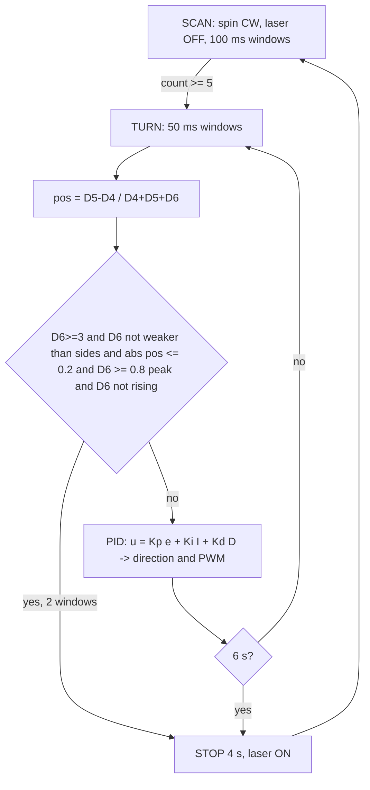
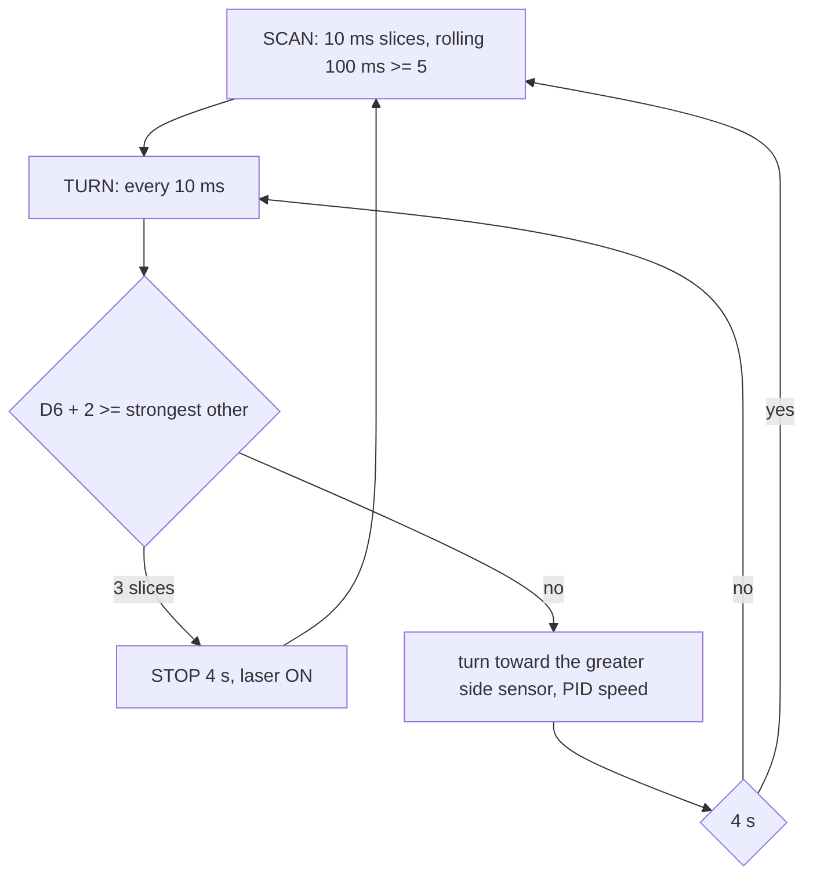
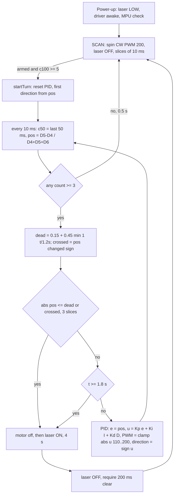
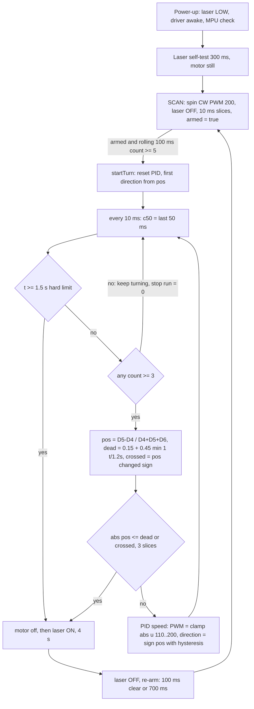
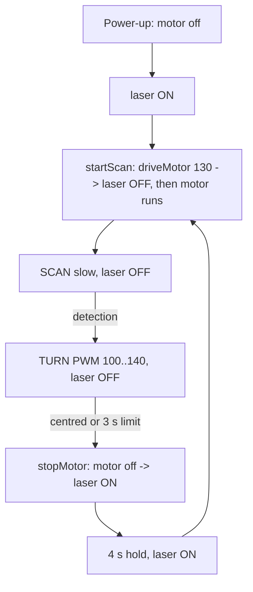

# Spin Detect Clock – documentation (one file)

> **Latest version: v0.5** – see **Part 4** at the end (slow speed, laser ON = motor OFF); v0.4 is Part 3. Part 1 (overview, v0.1–v0.3) and Part 2 (code explanation, v0.3) below are kept exactly as they were written; Part 3 describes what changed in v0.4.
> Run: `pio run -e spin_detect_clock -t upload` then `pio device monitor -e spin_detect_clock` (115200 baud).

---

# PART 1

# Spin Detect Clock – overview: process, problems, maths and flowcharts per version

This is the **overview document** for `spin_detect_clock`. The **code document** (function-by-function explanation of the current version) is [Part 2 below](#spin-detect-clock--code-explanation-current-version-v03). Only these two documents are kept for this program; each new version adds a section here and updates the code document.

## 1. What we need to achieve

* The assembly spins (like a clock hand) with the laser OFF and watches three IR sensors: D4 and D5 on the sides, **D6 in the centre on the laser axis**.
* When the message is seen, rotate D6 **toward the message** (clockwise or anti-clockwise, using a PID loop), and **stop quickly once D6 is centred on it**.
* Stop for 4 s with the laser ON for all of it, then laser OFF and scan again.
* The stop must be reliable: it must not need seconds of "determining" before the motor stops.

## 2. Version overview

| Version | Idea | Result on the bench / in analysis |
|---|---|---|
| v0.1 | centroid position `pos`, PID on `pos`, stop when 5 conditions hold (centred, D6 strong, D6 at its peak, not rising, ≥ 2 windows) | **rotation was right**, but the motor took about 4 s (the timeout) to stop |
| v0.2 | 10 ms slices, stop when D6 ≥ the strongest other sensor, turn toward the greatest side sensor | stops fast, but the **rotation was no longer the clock/PID behaviour** and it stopped before really centring |
| **v0.3** (current) | v0.1 rotation (centroid PID) + 10 ms slices + **robust stop** (widening dead band, zero-crossing, hard limit) | stops in about 0.5 s in the analysis, centring as good as v0.1 |

## 3. Method used to analyse before changing the code

Each version was written as a small computer model (cosine beam ±45°, bursty count noise, first-order motor response, the same PID code) and compared on the same cases: 3 sensor layouts × 3 signal strengths × 5 targets × 8 random seeds = 40 runs per cell. Signal strengths: strong (72 counts / 100 ms, message always on), weak (40, message off 25 % of the time), very weak (25, off 40 %). This showed *why* v0.1 stopped late (section 4) and *whether* the v0.3 change fixes it (section 6) before any code was handed over. The model is not the real hardware: it shows the behaviour of the logic, not the real numbers.

---

## 4. Version v0.1 – centroid PID, five-condition stop

**Need:** rotate toward the message like a clock hand, stop when D6 is centred.
**What was done:**
* every 50 ms window: `pos = (D5 − D4)/(D4 + D5 + D6)` (sensor weights −1, +1, 0)
* PID on `e = pos`: `u = Kp·e + Ki·∫e + Kd·de/dt`, direction `sign(u)`, PWM `clamp(|u|, 110, 200)`
* stop only when all of these held for 2 windows: `D6 ≥ 3`, `D6 + 4 ≥ strongest`, `|pos| ≤ 0.2`, `D6 ≥ 0.8·peak`, D6 not rising; 6 s timeout then stop + laser



**Problem:** the stop needed five conditions at the same time, each on noisy counts of only a few dozen per window. `|pos|` is noisy (`σ_pos ≈ √(D4+D5)/(D4+D5+D6)` ≈ 0.10 for 12/12/25 counts, so a 0.2 limit is only 2σ), the peak is inflated by noise (the maximum of noisy values), and "not rising" fails whenever a count ticks up by 3. The probability that all hold together for 2 windows in a row is small, so the loop ran until the 6 s timeout and then stopped.

Evidence (analysis, overlapping sensors −30°/+30°): stops before the timeout in 35/40 runs with a strong signal, but **19/40 with the weak signal and 11/40 with the very weak signal**, the rest running out the timeout – the "4 seconds to stop" behaviour.

---

## 5. Version v0.2 – compare and stop when D6 is the greatest

**Need:** stop quickly and check more often.
**What was done:** counting in 10 ms slices (rolling 50/100 ms, decision at 100 Hz); stop as soon as `D6 + 2 ≥ strongest other sensor` for 3 slices; otherwise turn toward the greatest side sensor, PID only for the speed (`e = weight·(side − D6)/(side + D6)`); no stop and no laser after a timeout.



**Problem:** it always stopped (40/40 in every case), but (1) the rotation was no longer the PID-on-position clock behaviour the bench result had approved (the direction was just "toward the greater sensor"), and (2) it stops at the moment D6 *ties* its neighbour, which is halfway between the sensors: residual error about 11–18° with overlapping sensors (v0.1 centroid: 2–5°) and up to 35° with sensors spread 120° apart.

---

## 6. Version v0.3 (current) – clock rotation restored, robust fast stop

**Need:** keep the v0.1 rotation, make the stop reliable and quick.
**What was done:**
1. **Rotation** back to the v0.1 centroid PID (`e = pos`, direction `sign(u)`, PWM 110–200), now updated every 10 ms.
2. **Counting** from v0.2: 10 ms slices, rolling `c100` (scan detection, K = 5) and `c50` (turn / stop, K = 3).
3. **Stop** replaced by a single robust test, true for 3 slices (30 ms):
   * `|pos| ≤ dead(t)`, with `dead(t) = 0.15 + 0.45·min(1, t/1.2 s)` – it starts strict and widens so it cannot be missed, **or**
   * `pos` has **crossed zero** (changed sign) – the message passed the centre, so stop instead of hunting back;
   * the peak, "rising" and "D6 must be strong" conditions are removed (they were the ones that failed on noisy counts), so it also stops if D6 receives only little;
   * hard limit `FORCE_STOP_MS = 1800`: stop anyway while the message is on the sensors; D6 warning if it never received anything.



**Maths behind the change:**
* `σ_pos ≈ √(D4+D5)/(D4+D5+D6)` ≈ 0.10 (12/12/25 counts). Dead band 0.15 ≈ 1.5σ at the start, 0.20 (2σ) after ≈ 0.3 s, 0.60 (6σ) after 1.2 s: within 1.2 s the "centred" test is practically certain whenever the sensors see the message, instead of requiring five coincident conditions.
* Zero-crossing: if `pos` goes from + to − (|pos| ≥ 0.05 on both sides) the message lies between the two last readings, i.e. at the centre to within the step of one slice (`ω·10 ms` ≈ 0.6–1.8°).
* Latency: 10 ms slice + 30 ms confirmation + (50 ms of integration inside the rolling count); worst case 1.8 s by the hard limit.
* Overshoot at the stop: `ω_min · t_brake` ≈ 64 °/s · 50 ms ≈ 3° (assumed motor response); the last 30 ms are run at the minimum PWM for this reason.

**Analysis result (same 40-run cells, `|error|` = median pointing error at the stop, time = turn start to stop):**

| Layout | Signal | v0.1 stops | v0.1 time (median / p90) | v0.2 stops, error | v0.3 stops | v0.3 time (median / p90) | v0.3 error |
|---|---|---|---|---|---|---|---|
| overlapping −30°/+30° | strong | 35/40 | 0.85 / 1.85 s | 40/40, 11° | **40/40** | 0.60 / 0.65 s | 5° |
| overlapping −30°/+30° | weak | 19/40 | 1.15 / 3.30 s | 40/40, 15° | **40/40** | 0.59 / 0.66 s | 4° |
| overlapping −30°/+30° | very weak | 11/40 | 0.85 / 1.70 s | 40/40, 18° | **40/40** | 0.52 / 0.65 s | 5° |
| 120° apart | strong | 36/40 | 0.98 / 1.60 s | 40/40, 37° | **40/40** | 0.47 / 0.93 s | 35° |
| 120° apart | very weak | 23/40 | 0.80 / 1.10 s | 39/40, 31° | **40/40** | 0.54 / 0.93 s | 30° |

Reading: in this analysis v0.3 always stops (in ≈ 0.5–0.9 s) and keeps the centring accuracy of v0.1 (about 4–5° when the sensor beams overlap). With sensors 120° apart the information is only "which sensor sees it", so any version is limited to roughly the beam width (30–35°) – that is a layout limit, not a stop problem.

**Open points / what to check on the bench:**
* motor response (`MIN_TRACK_PWM`, ω) is assumed – measure it;
* direction check (D4 = anti-clockwise side, D5 = clockwise side is assumed);
* if the stop often reaches the 1.8 s limit on the real hardware, lower `RELAX_MS` / raise `DEAD_START`; if the laser lands off the target, lower `DEAD_START`;
* compare the printed lines (`TURN … e:`) before the stop with the analysis: `e` should fall toward 0 and cross it.

---

## 7. How to add the next version
1. Add a section "Version vX" in this file: need, what was done, problem found, maths, flowchart, analysis/bench result.
2. Update [Part 2 below](#spin-detect-clock--code-explanation-current-version-v03) to describe the new code.
3. Keep only these two documents for this program.

---

# PART 2

# Spin Detect Clock – code explanation (current version v0.3)

Environment `spin_detect_clock` · source [src/spin_detect_clock_main.cpp](src/spin_detect_clock_main.cpp) · Nano V3 · **115200 baud**.
This is the **code document** (what each part of the program does, with the maths it uses). The **overview document** – goal, what was done, problems and the flowchart/maths of every version – is [Part 1 above](#spin-detect-clock--overview-process-problems-maths-and-flowcharts-per-version).
`spin_detect` ([spin_detect.md](spin_detect.md)) is a separate program and is not changed.

```
pio run -e spin_detect_clock -t upload
pio device monitor -e spin_detect_clock
```

> **Status: compiles; checked only with a computer simulation, not bench tested.** Gains, sensor layout and motor response are assumptions – tune with section 8.

## 1. What the program does

The motor scans clockwise with the laser OFF. When a sensor sees the message, a PID loop turns the assembly like a clock hand until **D6** (the centre sensor, on the laser axis) is centred on the message, then it stops fast; the laser is ON for the whole 4 s stop, then OFF and scanning resumes. Sensor counts are read in 10 ms slices and a decision is made every slice.

## 2. Wiring

| Signal | Pin |
|---|---|
| S1 / S2 / S3 = D4 / D5 / D6 (TSOP4138, active-LOW, `INPUT_PULLUP`) | D4 = anti-clockwise side, D5 = clockwise side, D6 = centre (laser axis) |
| Motor nSLEEP / DIR / PWM | D7 / D8 / D9 (DIR HIGH = clockwise) |
| Laser (HIGH = ON) | D10 |
| MPU6050 VCC, GND (common), SDA, SCL, AD0, INT/XDA/XCL | 5 V, GND, A4, A5, GND (0x68), not connected – display only |

`SENSOR_WEIGHT = {-1, +1, 0}` and `CENTRE_SENSOR = 2` describe this layout; swap the weights if the sides are the other way round.

## 3. Program structure

| Function | What it does |
|---|---|
| `setup()` | laser LOW first, motor driver awake, sensors `INPUT_PULLUP`, MPU6050 check, start scanning |
| `loop()` | one 10 ms slice per pass: `sampleSlice` → state step (`SCAN` / `TURN` / `STOP`) → print every 100 ms |
| `sampleSlice(ms)` | counts LOW reads of the 3 sensors for one slice, stores it in a ring of 10 slices and computes `c100` (last 100 ms) and `c50` (last 50 ms) |
| `strongest(c)` | index of the largest count |
| `positionOf(c, thr)` | message position `pos` from −1 to +1 relative to D6 (centroid of the sensor weights) |
| `startScan()` | laser OFF, then motor clockwise at `SPIN_SPEED` |
| `startTurn()` | resets the PID and stop memory, picks the first direction from `pos` |
| `turnStep(now)` | the heart of v0.3: stop test → PID → motor command, every slice |
| `startStop(why)` | motor off first, then laser ON, 4 s timer |
| `endStop()` | laser OFF, re-arm required, scan again |
| `driveMotor`, `stopMotor`, `laserSet` | the only places that touch the motor and laser pins |
| `imuInit`, `imuRead`, `printLine` | MPU6050 and the output line |

State machine:
```
SCAN ──(armed and rolling 100 ms count ≥ 5)──► TURN ──(stop test passes 3 slices | 1.8 s limit)──► STOP (4 s, laser ON) ──► SCAN
                                                 └──(no signal 0.5 s | 2.5 s safety net)──► SCAN
```

## 4. Maths used in the code

**Counting.** Loop time ≈ 3 · 4.5 µs + 100 µs + ~3 µs ≈ 117 µs (estimate), so a 10 ms slice holds ≈ 85 reads per sensor.
```
c100[i] = Σ last 10 slices   (100 ms)     scan detection: max(c100) ≥ 5  (spin_until_ir value, ≈ 0.6 % duty)
c50[i]  = Σ last  5 slices   ( 50 ms)     turn / stop:    counts ≥ 3 are used (same duty)
```
**Position (the clock error).**
```
pos = Σ weight_i · c50_i / Σ c50_i = (D5 − D4) / (D4 + D5 + D6)          only counts ≥ 3; −1 … +1; + = message clockwise of D6
setpoint = 0 (message centred on D6),  error e = pos
```
Noise on `pos`: counts are roughly Poisson, so `σ_pos ≈ √(D4 + D5) / (D4 + D5 + D6)`; for D4 = D5 = 12, D6 = 25 → σ ≈ 0.10.

**PID.**
```
I ← clamp(I + e·dt, ±1), reset when e changes sign          D = 0.8·D + 0.2·(e − e_prev)/dt          dt ≈ 10 ms
u = Kp·e + Ki·I + Kd·D          Kp = 140, Ki = 40, Kd = 6
direction = sign(u)  (+ clockwise)          PWM = clamp(|u|, 110, 200)   → big error fast, small error slow, never below 110
```
**Stop test (new in v0.3).** Every slice, while a signal is present (some count ≥ 3):
```
dead(t) = 0.15 + 0.45 · min(1, t / 1.2 s)           dead band widens from 0.15 to 0.60 in 1.2 s
crossed = pos changed sign (|pos| ≥ 0.05) since the turn began      the message passed the centre
centred = |pos| ≤ dead(t)  OR  crossed
stop when `centred` has held for 3 slices (30 ms);   hard limit: stop at 1.8 s if the message is still on the sensors
```
Why it works: at t = 0 the dead band (0.15) is about 1.5 σ of the noise, so a good alignment stops almost immediately; if noise or a coarse layout keeps `|pos|` above it, the band reaches 2 σ at ≈ 0.3 s and 6 σ at 1.2 s, so the condition is bound to be true well before the 1.8 s limit. Nothing here needs D6 itself to be strong, only that the sensors see the message.

**Timing.** Slice 10 ms, stop confirmation 30 ms, decision latency ≤ 10 ms + 50 ms of integration. Stop time `STOP_MS = 4000` is timed to ≈ 1 ms (the last slice is shortened) plus the oscillator tolerance. Overshoot after the stop command: `ω · t_brake`; at ω = 64 °/s (PWM 110, assumed) and 50 ms → 3°.

## 5. Constants (top of the file)

| Constant | Default | Meaning |
|---|---|---|
| `SENSOR_PINS`, `SENSOR_WEIGHT`, `CENTRE_SENSOR` | D4 D5 D6, `{-1,+1,0}`, 2 | layout |
| `SPIN_SPEED`, `SCAN_CLOCKWISE` | 200, true | scan PWM / direction |
| `SLICE_MS`, `RING`, `FAST_SLICES` | 10 ms, 10, 5 | counting slices and rolling windows |
| `DETECT_THRESHOLD`, `TRACK_THRESHOLD` | 5 per 100 ms, 3 per 50 ms | signal thresholds |
| `CLEAR_SLICES_TO_REARM` | 20 | 200 ms without signal before the next detection |
| `KP`, `KI`, `KD`, `I_MAX` | 140, 40, 6, 1 | PID |
| `MIN_TRACK_PWM`, `MAX_TRACK_PWM` | 110, 200 | smallest PWM that still turns / limit |
| `DEAD_START`, `DEAD_END`, `RELAX_MS` | 0.15, 0.60, 1200 | dead band |
| `SIGN_MIN`, `STOP_SLICES` | 0.05, 3 | zero-crossing sensitivity, confirmation slices |
| `FORCE_STOP_MS`, `TRACK_TIMEOUT_MS`, `LOST_SLICES` | 1800, 2500, 50 | hard stop, safety net, lost message |
| `STOP_MS` | 4000 | stop time with the laser ON |
| `REVERSE_PAUSE_MS` | 30 | pause before the motor reverses |

## 6. Output
Every 100 ms:
```
S1(D4): 5  S2(D5): 40  S3(D6): 60  DETECTED | Acc(g) X:-0.68 Y:-0.60 Z:0.51 | Gyro(dps) X:-5.7 Y:2.7 Z:-3.8 | TURN CW pwm130 e:+0.40
```
`S1(D4): n` = LOW reads in the last 100 ms; `DETECTED` / `--`; Acc in g (±2 g), Gyro in dps (±1000 dps, bias not removed); last field `SCAN CW` (`arming` until clear), `TURN CW/CCW pwm… e:…` (PID error), or `STOP x.xs LASER ON`. Event lines mark each state change, including `>>> STOP (D6 centred on the message) - laser ON <<<` and the D6 warning.

## 7. Laser rule
The laser (D10) is driven LOW first in `setup()`, is OFF in `SCAN` and `TURN`, and HIGH only inside `STOP`. Order at a stop: motor off, then laser ON; at its end: laser OFF, then the motor starts.

## 8. Tuning and bench checks
1. `ir_sensor_test`: D4/D5 on the sides you configured, D6 in the middle; D6 gets counts when the beacon is on its axis.
2. Direction: beacon on the clockwise side → TURN field shows `CW` and D6 moves toward it; otherwise swap `SENSOR_WEIGHT`.
3. `MIN_TRACK_PWM`: smallest PWM that reliably turns the assembly.
4. Stop: the time between `>>> message on S…` and `>>> STOP` should be well under 1.8 s (`pio device monitor -e spin_detect_clock --filter time`). If it often runs into the 1.8 s limit, the beam geometry or `MIN_TRACK_PWM` is the cause – raise `DEAD_START` or lower `RELAX_MS`.
5. Aim: if the laser lands off the target, lower `DEAD_START` (tighter) – the dead band still widens if it cannot settle.
6. `KP`, `KD`: reduce `KP` if it overshoots; `KI` only if it settles on one side.

---

# PART 3 – Version v0.4 (latest): the motor must always stop, and the laser must come ON

## 3.1 What we need to achieve
* Every detection must end in a **stop** of the motor, and the **laser must be ON** for the whole stop (4 s); the laser is OFF while the assembly moves.
* Keep the v0.1/v0.3 clock rotation (centroid PID), keep the fast 10 ms decision loop.

## 3.2 Problem reported
On the real hardware v0.3 spun but **never stopped**, and because the laser is only switched on inside the stop, **the laser never came ON**.

## 3.3 Analysis (before the code was changed)
The program was read line by line and every path that leads to a stop was checked. There is only one place that stops the motor (`startStop`), and it is only reached from `turnStep`, which is only entered when scanning is **armed** and a detection occurs. Findings:

| # | Finding in v0.3 | Effect |
|---|---|---|
| 1 | **Arming needs 200 ms with no signal** (`CLEAR_SLICES_TO_REARM = 20`), and the program starts *un-armed* | with three sensors 120° apart the gaps between the beams are too short to ever give 200 ms of "clear" → the detection is **never armed → never turns → never stops → laser never ON** |
| 2 | A turn was abandoned back to *scanning* (no stop) when the signal vanished for 0.5 s or after 2.5 s | a flickering message or the gap between two beams ended the turn without a stop |
| 3 | The hard stop limit was only reached while the signal was present | with a bursty message the limit could be skipped |
| 4 | Direction followed the sign of `u = Kp·e + Ki·I + Kd·D`, with a 30 ms pause on every reversal | when `e` is near 0 the sign flips on noise: the motor chatters instead of "really rotating" |
| 5 | No way to tell whether the laser pin works | if the wiring were wrong nothing would show it |

Math for finding 1: the clear gap between two sensor beams lasts `t_gap = (s − β)/ω` with spacing `s = 120°`, beam width `β = 90°` (±45°). At the scan speed ω ≈ 180 °/s (PWM 200, assumed) `t_gap = 30° / 180 °/s = 167 ms`; the rolling 100 ms window stretches the "signal" on both sides, and the computer model gives a longest clear run of **190 ms < 200 ms**. At 64 °/s it would be 470 ms (arms), which is why slower spinning "sometimes works" but scanning at full speed does not.

| Layout (noise-free model, rolling 100 ms window, K = 5) | spin 180 °/s | spin 64 °/s |
|---|---|---|
| 3 sensors 120° apart | longest clear 190 ms → **never arms** | 550 ms → arms |
| 60° apart | 840 ms | 2390 ms |
| overlapping 30° | 1180 ms | 3320 ms |

Full-cycle model (scan → detect → turn → stop → 4 s → re-arm, 3 sensors 120° apart, 20 runs × 40 s):

| Signal | v0.3: runs that ever stopped | v0.3 first stop | v0.4: runs that ever stopped | v0.4 first stop | v0.3 / v0.4 stops in 40 s |
|---|---|---|---|---|---|
| steady 72 counts / 100 ms (like your `72 / 71 / 71`) | **4 / 20** | 12.3 s | **20 / 20** | **0.6 s** | 0.2 / 9.0 |
| bursty 40 counts, message off 25 % | 20 / 20 | 2.1 s | 20 / 20 | 0.7 s | 6.9 / 8.7 |

The steady strong signal (the typical bench condition) is exactly the case where v0.3 does not stop. The model is not the hardware: it shows the behaviour of the logic.

## 3.4 What was done (v0.4)
1. **Armed from power-up**; after a stop it re-arms after **100 ms without signal or after `REARM_DELAY_MS = 700 ms`**, whichever comes first (700 ms × 180 °/s ≈ 126° > the 90° beam, so the same target has been left behind). It can no longer wait for a gap that never comes.
2. **Every turn ends in a stop**: hard limit `FORCE_STOP_MS = 1500` measured from the start of the turn, checked first, independent of the sensors. `TRACK_TIMEOUT_MS` and the "lost → scan again" exits were removed; if the message is missing for a moment the assembly keeps turning the same way.
3. The stop test is unchanged from v0.3 (dead band widening 0.15 → 0.60 over 1.2 s, or zero-crossing, for 3 slices = 30 ms).
4. **Direction from the sign of `pos` with hysteresis** (`DIR_HYST = 0.10`, about one σ of the noise on `pos`); the PID only sets the speed (`|u|` limited to 110–200). No more chatter.
5. **Laser self-test at power-up**: 300 ms pulse (`LASER_SELF_TEST_MS`) while the motor is still, printed as `Laser self-test: ON now... / ...laser OFF`; it proves that D10 drives the laser. Set to 0 to disable.
6. Output tail shows `SCAN CW rearming` while waiting to re-arm.

## 3.5 Maths of the new parts
```
armed(t) = true at power-up;  after a stop at t0:  armed when (no signal for 100 ms) OR (t ≥ t0 + 700 ms)
turn:      t_turn ≤ FORCE_STOP_MS = 1.5 s  → motor stop at the latest 1.5 s after the detection (+ ≤ 10 ms slice)
direction: dir = sign(pos) if |pos| ≥ 0.10, else keep;      PWM = clamp(|Kp·e + Ki·I + Kd·D|, 110, 200)
stop:      |pos| ≤ dead(t) = 0.15 + 0.45·min(1, t/1.2 s)  OR  pos crossed zero,  for 3 slices (30 ms)
laser:     HIGH only inside STOP (and in the 300 ms power-up self-test); motor off before the laser ON, laser OFF before the motor starts
```
Worst-case time from detection to stop: 1.5 s (hard limit); typical: 0.5–0.7 s in the model (turn distance / speed). Stop time 4 s is timed to ≈ 1 ms.

## 3.6 Flowchart v0.4


## 3.7 Code changes since v0.3 (src/spin_detect_clock_main.cpp)

| Item | v0.3 | v0.4 |
|---|---|---|
| `armed` initial value | `false` | `true` |
| Re-arm after a stop | `CLEAR_SLICES_TO_REARM = 20` (200 ms clear) | `CLEAR_SLICES_TO_REARM = 10` **or** `REARM_DELAY_MS = 700` (new `rearmAtMs`) |
| `FORCE_STOP_MS` | 1800, checked after the signal-present test | **1500, checked first, always** |
| `TRACK_TIMEOUT_MS`, `LOST_SLICES`, `lostSlices` | 2500 / 50 → back to scanning | **removed** (the turn always ends in a stop) |
| Direction | `sign(u)` | `sign(pos)` with `DIR_HYST = 0.10` |
| Laser self-test | none | `LASER_SELF_TEST_MS = 300` in `setup()` |
| Output | `SCAN CW arming` | `SCAN CW rearming` |
| Sections of the Part 2 text that are now different | "state machine" arrows to SCAN on lost/timeout, constants table rows for `TRACK_TIMEOUT_MS`, `LOST_SLICES`, `CLEAR_SLICES_TO_REARM` (20), `FORCE_STOP_MS` (1800) | see the table above |

## 3.8 If it still does not stop – what to check
Watch the serial lines in this order: (1) `Laser self-test: ON now...` – the laser must light for 0.3 s (if not, D10 wiring or laser power); (2) `>>> message on Sx: PID turn ...` – a detection started the turn (if the `DETECTED` marker shows but this line never appears, the count is below `DETECT_THRESHOLD`); (3) `>>> STOP (D6 centred on the message)` or `>>> STOP (time limit)` – the stop and the laser ON, with `STOP x.xs LASER ON` counting down from 4.0; (4) `WARNING: D6 never received the message` – D6 is not seeing the beacon. If the stop happens by `time limit` most of the time, the beams do not give a usable position: lower `RELAX_MS` or raise `DEAD_START`. Please paste the serial lines if a step fails.

---

# PART 4 – Version v0.5 (latest): slow speed, laser ON whenever the motor is OFF

## 4.1 What we need to achieve
* The assembly turns **slowly**.
* The **laser is ON whenever the motor is OFF**, and OFF whenever it runs – independent of any detection logic.

## 4.2 Problem reported
After v0.4 the laser was still not seen ON, and the speed was too fast. In v0.4 the laser was tied to the *stop state* (`startStop`), so it only lit if a detection happened first.

## 4.3 What was done (only these changes)
1. **Laser rule moved into the motor functions** – `stopMotor()` sets the laser ON after the motor has stopped; `driveMotor()` sets it OFF before the motor starts. A reversal pause inside `driveMotor()` does not touch the laser. The motor is off at power-up, so the laser is **ON from the first statement of `setup()`** until scanning starts (about 1.5 s); the 300 ms self-test of v0.4 was removed because this makes it unnecessary.
2. **Slow speed:**

| Constant | v0.4 | v0.5 | Why it also changed |
|---|---|---|---|
| `SPIN_SPEED` (scan PWM) | 200 | **130** | slow |
| `MIN_TRACK_PWM` / `MAX_TRACK_PWM` | 110 / 200 | **100 / 140** | slow turning |
| `FORCE_STOP_MS` (hard limit of a turn) | 1500 | **3000** | the same turn takes about twice as long |
| `RELAX_MS` (dead band widening time) | 1200 | **2400** | keep the dead band in step with the longer turn |
| `REARM_DELAY_MS` | 700 | **1500** | at the slow speed 700 ms is only about 63° of scanning, less than the 90° beam, so the same target could trigger again |

## 4.4 Maths
Assumed motor response (not measured): `ω ≈ (PWM − 60) · 1.29 °/s` → PWM 130 ≈ 90 °/s, 100 ≈ 52 °/s, 140 ≈ 103 °/s (was 180 °/s at 200).
```
turn time   t = angle / ω         165° at about 70 °/s = 2.4 s   → hard limit 3.0 s (was 1.5 s at the fast speed)
beam gap    t_gap = (s − β)/ω = 30° / 90 °/s = 333 ms   (was 167 ms)   → longer than the 100 ms clear needed to re-arm
re-arm      1500 ms · 90 °/s = 135° > β = 90°  → the same target has been left behind
dead band   dead(t) = 0.15 + 0.45 · min(1, t / 2.4 s)
laser       laser = ON  ⇔  PWM = 0 ;   order: motor stops → laser ON ;  laser OFF → motor starts
```
Slower scanning also helps detection: the sensor stays in the beam longer (`β/ω` about 1.0 s instead of 0.5 s) and the gap between beams is twice as long.

Analysis of the slow settings (computer model, 3 sensor layouts, steady 72 counts / 100 ms and bursty 40 counts with the message off 25 %, 20 runs × 40 s each): a stop happened in **20 / 20 runs**, the first stop after about 0.8–1.1 s (worst 2.7 s) and none was forced by the hard limit. The model is not the real hardware.

## 4.5 Flowchart v0.5 (laser and speed)


## 4.6 Code changes since v0.4 (src/spin_detect_clock_main.cpp)
`driveMotor()` calls `laserSet(false)` before the PWM write; `stopMotor()` calls `laserSet(true)` after the PWM write; `setup()` starts with `laserSet(true)`; the self-test block and `LASER_SELF_TEST_MS` are removed; the constants in the table of 4.3 changed. Nothing else changed (detection, PID, stop test, output and re-arm rule are as in v0.4).
