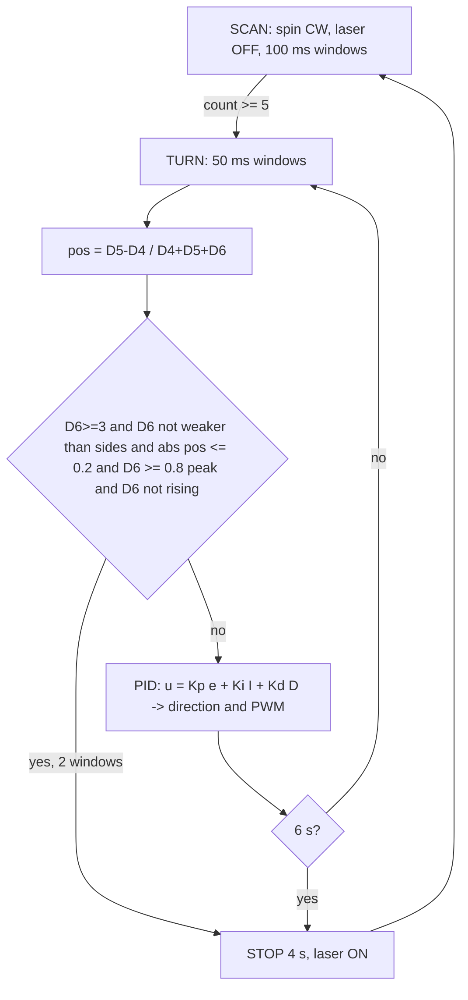
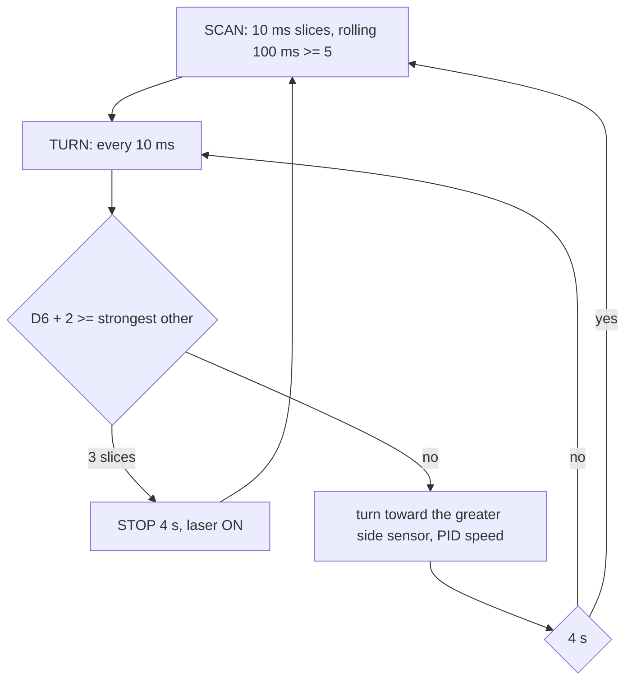
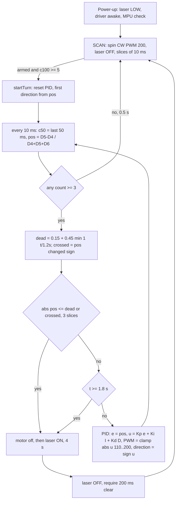

# Spin Detect Clock – overview: process, problems, maths and flowcharts per version

This is the **overview document** for `spin_detect_clock`. The **code document** (function-by-function explanation of the current version) is [spin_detect_clock.md](spin_detect_clock.md). Only these two documents are kept for this program; each new version adds a section here and updates the code document.

## 1. What we need to achieve

* The assembly spins (like a clock hand) with the laser OFF and watches three IR sensors: D4 and D5 on the sides, **D6 in the centre on the laser axis**.
* When the message is seen, rotate D6 **toward the message** (clockwise or anti-clockwise, using a PID loop), and **stop quickly once D6 is centred on it**.
* Stop for 4 s with the laser ON for all of it, then laser OFF and scan again.
* The stop must be reliable: it must not need seconds of "determining" before the motor stops.

## 2. Version overview

| Version | Idea | Result on the bench / in analysis |
|---|---|---|
| v0.1 | centroid position `pos`, PID on `pos`, stop when 5 conditions hold (centred, D6 strong, D6 at its peak, not rising, ≥ 2 windows) | **rotation was right**, but the motor took about 4 s (the timeout) to stop |
| v0.2 | 10 ms slices, stop when D6 ≥ the strongest other sensor, turn toward the greatest side sensor | stops fast, but the **rotation was no longer the clock/PID behaviour** and it stopped before really centring |
| **v0.3** (current) | v0.1 rotation (centroid PID) + 10 ms slices + **robust stop** (widening dead band, zero-crossing, hard limit) | stops in about 0.5 s in the analysis, centring as good as v0.1 |

## 3. Method used to analyse before changing the code

Each version was written as a small computer model (cosine beam ±45°, bursty count noise, first-order motor response, the same PID code) and compared on the same cases: 3 sensor layouts × 3 signal strengths × 5 targets × 8 random seeds = 40 runs per cell. Signal strengths: strong (72 counts / 100 ms, message always on), weak (40, message off 25 % of the time), very weak (25, off 40 %). This showed *why* v0.1 stopped late (section 4) and *whether* the v0.3 change fixes it (section 6) before any code was handed over. The model is not the real hardware: it shows the behaviour of the logic, not the real numbers.

---

## 4. Version v0.1 – centroid PID, five-condition stop

**Need:** rotate toward the message like a clock hand, stop when D6 is centred.
**What was done:**
* every 50 ms window: `pos = (D5 − D4)/(D4 + D5 + D6)` (sensor weights −1, +1, 0)
* PID on `e = pos`: `u = Kp·e + Ki·∫e + Kd·de/dt`, direction `sign(u)`, PWM `clamp(|u|, 110, 200)`
* stop only when all of these held for 2 windows: `D6 ≥ 3`, `D6 + 4 ≥ strongest`, `|pos| ≤ 0.2`, `D6 ≥ 0.8·peak`, D6 not rising; 6 s timeout then stop + laser

**Problem:** the stop needed five conditions at the same time, each on noisy counts of only a few dozen per window. `|pos|` is noisy (`σ_pos ≈ √(D4+D5)/(D4+D5+D6)` ≈ 0.10 for 12/12/25 counts, so a 0.2 limit is only 2σ), the peak is inflated by noise (the maximum of noisy values), and "not rising" fails whenever a count ticks up by 3. The probability that all hold together for 2 windows in a row is small, so the loop ran until the 6 s timeout and then stopped.

Evidence (analysis, overlapping sensors −30°/+30°): stops before the timeout in 35/40 runs with a strong signal, but **19/40 with the weak signal and 11/40 with the very weak signal**, the rest running out the timeout – the "4 seconds to stop" behaviour.

---

## 5. Version v0.2 – compare and stop when D6 is the greatest

**Need:** stop quickly and check more often.
**What was done:** counting in 10 ms slices (rolling 50/100 ms, decision at 100 Hz); stop as soon as `D6 + 2 ≥ strongest other sensor` for 3 slices; otherwise turn toward the greatest side sensor, PID only for the speed (`e = weight·(side − D6)/(side + D6)`); no stop and no laser after a timeout.

**Problem:** it always stopped (40/40 in every case), but (1) the rotation was no longer the PID-on-position clock behaviour the bench result had approved (the direction was just "toward the greater sensor"), and (2) it stops at the moment D6 *ties* its neighbour, which is halfway between the sensors: residual error about 11–18° with overlapping sensors (v0.1 centroid: 2–5°) and up to 35° with sensors spread 120° apart.

---

## 6. Version v0.3 (current) – clock rotation restored, robust fast stop

**Need:** keep the v0.1 rotation, make the stop reliable and quick.
**What was done:**
1. **Rotation** back to the v0.1 centroid PID (`e = pos`, direction `sign(u)`, PWM 110–200), now updated every 10 ms.
2. **Counting** from v0.2: 10 ms slices, rolling `c100` (scan detection, K = 5) and `c50` (turn / stop, K = 3).
3. **Stop** replaced by a single robust test, true for 3 slices (30 ms):
   * `|pos| ≤ dead(t)`, with `dead(t) = 0.15 + 0.45·min(1, t/1.2 s)` – it starts strict and widens so it cannot be missed, **or**
   * `pos` has **crossed zero** (changed sign) – the message passed the centre, so stop instead of hunting back;
   * the peak, "rising" and "D6 must be strong" conditions are removed (they were the ones that failed on noisy counts), so it also stops if D6 receives only little;
   * hard limit `FORCE_STOP_MS = 1800`: stop anyway while the message is on the sensors; D6 warning if it never received anything.

**Maths behind the change:**
* `σ_pos ≈ √(D4+D5)/(D4+D5+D6)` ≈ 0.10 (12/12/25 counts). Dead band 0.15 ≈ 1.5σ at the start, 0.20 (2σ) after ≈ 0.3 s, 0.60 (6σ) after 1.2 s: within 1.2 s the "centred" test is practically certain whenever the sensors see the message, instead of requiring five coincident conditions.
* Zero-crossing: if `pos` goes from + to − (|pos| ≥ 0.05 on both sides) the message lies between the two last readings, i.e. at the centre to within the step of one slice (`ω·10 ms` ≈ 0.6–1.8°).
* Latency: 10 ms slice + 30 ms confirmation + (50 ms of integration inside the rolling count); worst case 1.8 s by the hard limit.
* Overshoot at the stop: `ω_min · t_brake` ≈ 64 °/s · 50 ms ≈ 3° (assumed motor response); the last 30 ms are run at the minimum PWM for this reason.

**Analysis result (same 40-run cells, `|error|` = median pointing error at the stop, time = turn start to stop):**

| Layout | Signal | v0.1 stops | v0.1 time (median / p90) | v0.2 stops, error | v0.3 stops | v0.3 time (median / p90) | v0.3 error |
|---|---|---|---|---|---|---|---|
| overlapping −30°/+30° | strong | 35/40 | 0.85 / 1.85 s | 40/40, 11° | **40/40** | 0.60 / 0.65 s | 5° |
| overlapping −30°/+30° | weak | 19/40 | 1.15 / 3.30 s | 40/40, 15° | **40/40** | 0.59 / 0.66 s | 4° |
| overlapping −30°/+30° | very weak | 11/40 | 0.85 / 1.70 s | 40/40, 18° | **40/40** | 0.52 / 0.65 s | 5° |
| 120° apart | strong | 36/40 | 0.98 / 1.60 s | 40/40, 37° | **40/40** | 0.47 / 0.93 s | 35° |
| 120° apart | very weak | 23/40 | 0.80 / 1.10 s | 39/40, 31° | **40/40** | 0.54 / 0.93 s | 30° |

Reading: in this analysis v0.3 always stops (in ≈ 0.5–0.9 s) and keeps the centring accuracy of v0.1 (about 4–5° when the sensor beams overlap). With sensors 120° apart the information is only "which sensor sees it", so any version is limited to roughly the beam width (30–35°) – that is a layout limit, not a stop problem.

**Open points / what to check on the bench:**
* motor response (`MIN_TRACK_PWM`, ω) is assumed – measure it;
* direction check (D4 = anti-clockwise side, D5 = clockwise side is assumed);
* if the stop often reaches the 1.8 s limit on the real hardware, lower `RELAX_MS` / raise `DEAD_START`; if the laser lands off the target, lower `DEAD_START`;
* compare the printed lines (`TURN … e:`) before the stop with the analysis: `e` should fall toward 0 and cross it.

---

## 7. How to add the next version
1. Add a section "Version vX" in this file: need, what was done, problem found, maths, flowchart, analysis/bench result.
2. Update [spin_detect_clock.md](spin_detect_clock.md) to describe the new code.
3. Keep only these two documents for this program.
